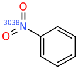
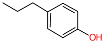

# Dicer Fragments

The files in this directory are derived from applying dicer to a recent Chembl.

Files are
```
FRAG_1_1.textproto
FRAG_1_2.textproto
FRAG_1_3.textproto
FRAG_1_4.textproto
FRAG_1_5.textproto
FRAG_1_6.textproto
FRAG_1_7.textproto
FRAG_1_8.textproto

FRAG_2_1.textproto
FRAG_2_2.textproto
FRAG_2_3.textproto
FRAG_2_4.textproto
FRAG_2_5.textproto
FRAG_2_6.textproto
FRAG_2_7.textproto
```

The FRAG_1* files contain dicer fragments with one attachment point. The
second number is the number of atoms in those fragments. So, FRAG_1_1.textproto
contains single atom substituents. Files are ordered by prevalence, the 'n: ...' value
below. The top of that file might look like
```
smi: "[3038CH4]" par: "CHEMBL477368" nat: 1 n: 89161
smi: "[3001CH4]" par: "CHEMBL2035304" nat: 1 n: 65672
smi: "[3038OH2]" par: "CHEMBL2071163" nat: 1 n: 45271
smi: "[3001OH2]" par: "CHEMBL2111064" nat: 1 n: 41088
smi: "[3038ClH]" par: "CHEMBL1981277" nat: 1 n: 38051
smi: "[3038NH3]" par: "CHEMBL4469714" nat: 1 n: 33871
smi: "[9001CH4]" par: "CHEMBL3219364" nat: 1 n: 31321
smi: "[9001OH2]" par: "CHEMBL144651" nat: 1 n: 21690
smi: "[3001NH3]" par: "CHEMBL2035304" nat: 1 n: 21044
smi: "[6007CH4]" par: "CHEMBL405641" nat: 1 n: 20217
smi: "[6044CH4]" par: "CHEMBL3561269" nat: 1 n: 19233
```
We see that the most common single atom substituent in Chembl is a single
Carbon atom, methyl substituent. Note that these are shown
here as 'CH4' since we want these fragments to be proper
molecules, when incorporated into another molecule, they will become
CH3.

Note that there are multiple 'CH4' present, each with a different isotope.
This is because the dicer fragments are generated with atom typing included,
```
dicer ... -P UST:AY -I atype ...
```

This particular run was generated with
```
dicer -B nosmi -P UST:AY -I atype -B nbamide -X 256 -B brcb -B bCCD3 \
      -B fragstatproto -B fragstat=dicer.fragstat -c -M 16 -M maxnr=10 \
      -v -B rpt=10000 chembl_36.oksize.sorted.smi
```

Although much of this is described in the [dicer documentation](/docs/Molecule_Tools/dicer.md)
some are worth discussion here.

The atom type selected, 'UST:AY' is a User Specified Type (UST), consisting
of whether or not the atom is aromatic (A), and the halogen compressed atomic
number (Y). The isotope placed on the fragment is the atom type of the atom
from which the fragment was detached. The actual isotopic values are arbitrary,
and could possibly change.

Using any atom type that includes connectivity, C or H, can be tricky.
A fragment might be excised from an aliphatic atom with two connections
`frag-C-*'. The isotope placed on 'frag' will be that of a two connected
aliphatic Carbon atom 'UST:ACY'. But if you then wish to place this fragment
onto another molecule, but in this one the 'C-*' attachment point has had
the existing fragment stripped, that may not work - the number of connections
will be different.

## Sidechain Replacement
Ignoring all atom type related isotopic information, replacing a sidechain is
straightforward. Imagine removing an existing Aniline Nitrogen and replacing it
with further Nitrogen substitued sidechains.

The reaction file might look like
```
name: "Aniline_plus_a"
scaffold {
  smarts: "[NH2]-c"
  remove_atom: 0
}
sidechain {
  id: 1
  smarts: "[>0NH>0]"
  join {
    a1: 1
    a2: 0
  }
}
```

and if we choose to add 3 atom sidechains, that could be done as
```
trxn -P Aniline_plus_a.rxn -Z aniline.smi FRAG_1_3.textproto
```
will generate molecules like



Note that the reaction did not specify a particular value for the isotope,
just ">0" so any of the fragments could be added.

Alternatively if we had an existing sidechain with an aliphatic
carbon as the join atom. For example if we wish to replace the propyl
group in a molecule like

where we want to preserve a [CH2] group as the first attachment point.

This could of course be done by specifying '[CD2]' as the join point
and telling trxn to ignore sidechains that do not match.
```
name: "replace propyl"
scaffold {
  id: 0
  smarts: "c!@-[CH2]-[CH3]"
  break_bond {
    a1: 0
    a2: 1
  }
  remove_fragment: 1
}
sidechain {
  id: 1
  smarts: "[>0CD1]"
  join {
    a1: 0
    a2: 0
    btype: SS_SINGLE_BOND
  }
}

