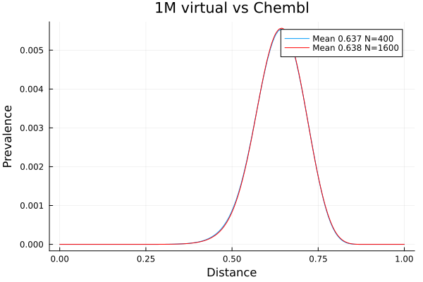

# Approximate Similarity Between Collections

A common task is to assess the similarity between two collections. For example
one may wish to compare a virtual library with a corporate collection of a 
public collection like Chembl.

Clearly this could be done with gfp_lnearneighbours, but comparing a 1 Million member library
with a 2M molecule library such as Chembl will be time consuming.

If what we are mostly interested in is the aggregate nature of the comparison, rather
than detailed pair-wise comparisons, we investigate a sampling strategy.

If we are to take random samples from the virtual library, and compare those randomly selected
molecules with Chembl, how quickly do those randomly selected molecules approximate the
actual distribution?

The tool gfp_compare_collections can do these calculations.

The reference collection, Chembl in this case, must be fingerprinted.

```
gfp_make.sh chembl.smi > chembl.gfp
```
For this experiment we start with 1000 acids + 1000 amines from Enamine. This generates
a 1M member virtual library - trxn takes about 10 seconds. It is very important that
the resulting smiles file be randomised - see below.

As the tool reads the fingerprints of the virtual library, every `-n` fingerprints it
writes a file containing the distribution of distances. We can then compare how the
shape of that distribution evolves as more and more molecules are sampled from the
virtual library. How many molecules need to be evaluated in order to get a reasonable
approximation to the complete distribution.

## HowTo
```
shuf virtual.smi | gfp_make.sh - | \
        gfp_compare_collections -h 8 -a 0.001 -f 200 -n 200 -S STEM -p chembl.gfp -
```
It is very important that the virtual library be randomised. This is because if it
has been enumerated, the molecules appearing sequentially will definitely not be randomised.

Note too that we never form the shuffled file, and fingerprints are only generated within
the pipeline.

The following options are recognised.

### -S \<stem\>
Every \<-n\> fingerprints read, a CSV file is written. This file contains the distribution
of number of distances vs the distance. For example the value associated with distance
0.20 will be the number of distances in the range 0.200 to 0.201 - the range is
divided into 1000 buckets.

A portion of that file might look like
```
Dist,Fraction
0.199,4.679843e-08
0.2,4.480701e-08
0.201,4.181988e-08
0.202,5.72534e-08
0.203,5.177699e-08
0.204,5.72534e-08
```
Plot both the first sample, taken after 400 fingerprints have been processed and another
sample after 1600 fingerprints are processed.


Subsequent plots show little difference from the above. We see that the distribution
has essentially converged after a quite small number of molecules have been compared.

### Convergence.
Every `-n` fingerprints read, the tool checks the current distribution of distances
with what it was on the previous check. If the differences are within the convergence
criterion specified, processing stops.

It is hard to know whether an absolute or relative tolerance would be most meaningful.
The `-a` option specifies an absolute tolernace. All bucketised distance count differences
must be less than this value in order for the distribution to be considered converged.

On the other hand, the relative convergence criterion compares the difference with
the mean of the current and previous distribution and all differences must be within
this value.

The absolute tolerance is attractive because it will quickly identify that the major
parts of the distribution have converged. But it will really not be checking those
regions with very low prevalences - see the numbers in the output above. On the
other hand the relative tolerance criterion ensures that the entire distribution
has stabilised. But in very low prevalence areas, that will likely not impact any
overall measures of the distribution.
 ### -h \<nthreads\>
The tool can run across multiple processors with OMP. This is beneficial. For example
comparing 2400 vrtual molecules against Chembl takes 272 seconds running single
threaded. Running 8 way parallel this is complete in 92 seconds, a speedup of about
3 - not wonderful, but worth doing.

## Summary
It does appear that a very small number of randomly selected molecules can
adequately define the overall distribution of distances between a reference
collection and another.
