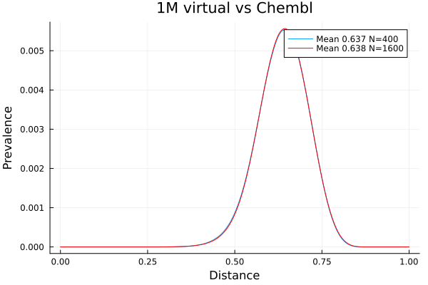

# Approximate Similarity Between Collections

`gfp_compare_collections` estimates the distribution of fingerprint distances
between two collections. It is intended for cases where the aggregate distance
profile is useful, but exhaustive pairwise output from tools such as
`gfp_lnearneighbours` would be too large or too slow to inspect directly.

A typical use case is comparing a large virtual library with a reference
collection such as Chembl. The reference collection is loaded once via `-p`; the
query collection is read as one fingerprint stream from the command line, which
may be `-` for standard input. The query stream should be randomised if it was
created by enumeration, otherwise early samples may not represent the full
library.

The reference collection must already be fingerprinted:

```shell
gfp_make.sh chembl.smi > chembl.gfp
```

Then stream a randomised query collection through `gfp_make.sh`:

```shell
shuf virtual.smi | gfp_make.sh - | \
  gfp_compare_collections -h 8 -a 0.001 -f 200 -n 200 -S STEM -p chembl.gfp -
```

This avoids creating an intermediate shuffled fingerprint file. The tool accepts
exactly one query fingerprint input file or stream.

## Output

`-S <stem>` is required. Each sampling point writes a CSV file named
`<stem>0.csv`, `<stem>1.csv`, and so on. The file contains the current
normalised distribution of retained distances:

```text
Dist,Fraction
0.199,4.679843e-08
0.2,4.480701e-08
0.201,4.181988e-08
0.202,5.72534e-08
0.203,5.177699e-08
0.204,5.72534e-08
```

The distance range is divided into 1001 buckets from 0.000 through 1.000. The
`Fraction` value is the fraction of all retained pairwise distances that fell in
that bucket. Distances larger than `-T` are skipped before the distribution is
normalised.



In the example that generated this plot, the first sample was taken after 400
query fingerprints and another after 1600. Subsequent plots showed little
change, suggesting that the aggregate distribution had converged after a small
sample of the query collection.

## Required Options

### `-p <fname>`

Fingerprint file for the reference collection. This is commonly a corporate
collection, Chembl, or another large background set. If `-s` is not supplied,
the tool first counts the number of fingerprints in this file.

### `-S <stem>`

Output stem for the sampled distribution files. Files are written as
`<stem>0.csv`, `<stem>1.csv`, etc.

## Sampling And Convergence

The first check happens after `-f <number>` query fingerprints. If `-f` is not
specified, the first check happens after 1000 query fingerprints. After each
check, the next check is scheduled `-n <number>` query fingerprints later. The
`-n` default is 1000.

At the first check there is no previous distribution, so the current distribution
is written and processing continues. Later checks compare the current
normalised distribution with the previous sampled distribution. If the selected
convergence criterion is satisfied, processing stops and the final distribution
is written.

Only one convergence criterion can be specified. If neither is specified, the
default is relative tolerance `0.01`.

### `-a <tol>`

Absolute tolerance. The distribution is converged when the absolute difference
in every bucket fraction is no greater than `<tol>`.

### `-r <tol>`

Relative tolerance. For buckets that differ, the absolute difference is divided
by the mean of the current and previous bucket fractions. The distribution is
converged only when every bucket is within `<tol>`. Buckets that were previously
zero and become non-zero prevent convergence at that check.

### `-T <dist>`

Maximum distance considered. Distances larger than `<dist>` are ignored. This is
useful when the short-distance part of the distribution is most important and
most cross-collection pairs are distant.

## Performance Options

### `-h <nthreads>`

Use OpenMP with `<nthreads>` threads. Each batch of query fingerprints is
compared against the reference collection in parallel.

### `-b <batch>`

Number of query fingerprints processed per batch. Batching amortizes OpenMP
threading overhead across multiple query fingerprints. The default is 10.

## Summary

For randomly ordered query streams, a relatively small sample can often define
the overall distance distribution well enough for collection-level comparison.
