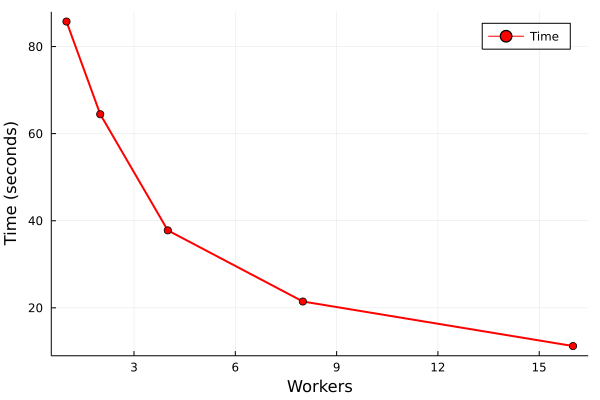

# gfp_nearneighbours_single_file

`gfp_nearneighbours_single_file` finds nearest neighbours within one fingerprint
file. There is no separate needle/haystack distinction: every fingerprint in the
input belongs to the same collection and may be a neighbour of any other input
fingerprint.

For comparisons of one collection against another, use `gfp_lnearneighbours`.
For workflows that already know the exact pairs to compare, consider
`gfp_pairwise_distances`: it reads a fingerprint file plus requested pairs of
items, computes only those distances, and writes the requested results. That can
be a better fit than a nearest-neighbour search when the application does not
need all neighbours within a file.

For anything beyond very small files, prefer the TBB version,
`gfp_nearneighbours_single_file_tbb`. As one concrete example, a 10k input file
took 5.5 seconds with the serial tool and 1.9 seconds with the TBB tool using
`-h 8`.

## Basic Usage

Find the single nearest neighbour of every molecule in a file:

```shell
gfp_make.sh <fingerprints> file.smi > file.gfp
gfp_nearneighbours_single_file_tbb -n 1 -h 8 file.gfp > file.nn
nplotnn file.nn > file.nn.smi
```

The resulting neighbour file has each target molecule followed by its nearest
neighbour according to the fingerprints in the `.gfp` file.

The two most important neighbour-selection options are `-n` and `-T`.

`-n <number>` keeps a fixed number of nearest neighbours for each molecule,
regardless of their distance.

`-T <distance>` keeps all neighbours within a distance threshold. This usually
means different molecules have different numbers of neighbours. Use this mode
when the output should represent a truncated symmetric distance matrix.

```shell
gfp_nearneighbours_single_file_tbb -T 0.4 -h 8 file.gfp > file.nn
```

## TFDataRecord Output

`-S <fname>` writes serialized `nnbr::NearNeighbours` protos in TFDataRecord
format. This is the format consumed by `train_test_split_optimise` and by the
[Truncated Distance Matrix](truncated_distance_matrix.md) API.

```shell
gfp_nearneighbours_single_file_tbb -T 0.4 -h 8 -S file.nn.tfdata file.gfp
```

For new truncated-distance-matrix workflows, prefer indexed TFDataRecord output:

```shell
gfp_nearneighbours_single_file_tbb -T 0.4 -h 8 -S indexed -S file.nn.tfdata file.gfp
```

`-S indexed` writes `nnbr::NearNeighboursIndices` protos. The target record still
contains its name and smiles, but each neighbour is stored as an input row number
rather than an identifier string. This makes the file smaller and faster to load.
`-S indexed` is currently supported by the TBB version.

Do not use `-z` when producing files for `TruncatedDistanceMatrix` unless omitted
molecules are genuinely irrelevant. The matrix loader needs one record for every
molecule whose identifier should be known, including molecules with no
neighbours. If `-z` suppresses no-neighbour records, those identifiers cannot be
recovered during loading.

The ordinary text-output `-o` option is separate from `-S indexed`. `-o` writes
neighbours as index numbers in the text neighbour-list output. `-S indexed`
changes the TFDataRecord proto type.

## Options

```text
 -n <number>      specify how many neighbours to find
 -t <dis>         discard distances shorter than <dis>
 -T <dis>         discard distances longer than <dis>
 -r <number>      ensure that all molecules have at least <number> neighbours
 -z               don't write molecules with no neighbours
 -H <fname>       write histogram of closest distances to <fname>
 -b               write minimal histogram data - two columns
 -N <tag>         write number neighbours as <tag>
 -A <TAG>         write average neighbour distance to <TAG>
 -p               write all pair-wise distances in 3 column form
 -j <precision>   output precision for distances
 -y               allow arbitrary distances
 -R <number>      report progress every <number> items processed
 -S <fname>       write nnbr::NearNeighbours TFDataRecord serialized protos to <fname>
 -S indexed       TBB version: write nnbr::NearNeighboursIndices protos, with neighbour indices
 -d               do NOT write neighbour smiles in the -S file (makes the file much smaller)
 -x               exclude smiles from the output
 -F ...           gfp options, enter '-F help' for details
 -V ...           Tversky specification, enter '-V help' for details
 -K ...           options for converting sparse fingerprints to fixed
 -X <distance>    abandon distance computation if any component > distance
 -o               text output: cross-referencing a single file, write neighbours as index numbers
 -s <number>      specify number of fingerprints in input - not necessary
 -I <tag>         specify identifier dataitem (default 'PCN<)
 -v               verbose output
```

## TBB Version

`gfp_nearneighbours_single_file_tbb` uses TBB to split the all-against-all work
across worker tasks. Most options are the same as the serial tool. The most
important TBB-specific option is `-h`, which controls the number of worker tasks.

Currently `-h` can be one of `1, 2, 4, 8, 16, 32`. The effective parallelism is
approximately half the `-h` value. On an 8-core machine, `-h 16` is usually close
to full machine utilisation, but scaling is not perfectly linear.



In the benchmark shown above, serial execution took 85 seconds. Ideal 8-way
speedup would give 10.1 seconds; the observed 11.22 seconds is unusually good
scaling for this workload.

The TBB source is generated for a fixed set of worker counts. The Ruby generator
is [gfp_nearneighbours_single_file_tbb.rb](/src/Utilities/GFP_Tools/gfp_nearneighbours_single_file_tbb.rb).
