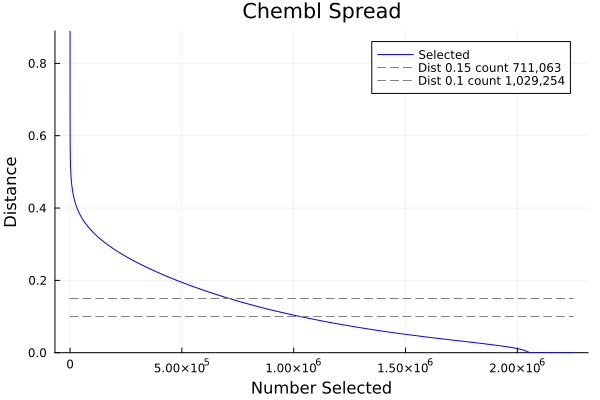

# spreadplot.jl

`spreadplot.jl` plots the monotonically decreasing distance trajectory produced
by a LillyMol `gfp_spread*` calculation. The trajectory provides an intuitive
measure of the internal diversity of a molecular collection.

The script is located at [contrib/bin/spreadplot.jl](/contrib/bin/spreadplot.jl).

## Overview

The spread tools perform greedy max/min selection. After choosing an initial
molecule, each subsequent molecule is the candidate whose distance to its
nearest previously selected molecule is greatest.

As more molecules are selected, the distance to the nearest previously selected
molecule cannot increase. The resulting trajectory therefore decreases
monotonically.

The shape of this curve characterises the collection:

- A curve that drops rapidly to low distances indicates limited internal
  diversity. For example, a collection described as 40,000 molecules might
  contain approximately 10,000 diverse structures followed by 30,000 close
  analogues of those structures.
- A curve that decreases slowly indicates a more diverse collection. Many
  molecules can be selected before a newly selected molecule is close to
  anything already selected.
- A trajectory that reaches zero indicates fingerprint duplicates. These may
  be exact duplicates or structures made equivalent by standardisation or by
  the fingerprint representation.

The result depends on the fingerprints, similarity measure, chemical
standardisation, and initial molecule used by the spread calculation. Curves
should only be compared when these choices are compatible.

The following ChEMBL trajectory includes several horizontal distance thresholds.
Each threshold shows how many molecules can be selected before the trajectory
reaches that distance.



## Workflow

First generate fingerprints and run one of the spread tools. When using the
standard LillyMol fingerprints, `gfp_spread_standard` is usually the preferred
implementation.

```shell
gfp_make.sh molecules.smi > molecules.gfp
gfp_spread_standard -h 8 molecules.gfp > molecules.spr
```

Convert the spread output to the CSV trajectory consumed by `spreadplot.jl`:

```shell
nplotnn -S molecules_spread.csv molecules.spr > molecules.spr.smi
```

The CSV file contains a selection position and distance:

```text
sel,distance
0,1
1,0.8692
2,0.8482
3,0.8296
4,0.8257
```

Generate a PNG plot:

```shell
spreadplot.jl -S molecules_spread molecules_spread.csv
```

This writes `molecules_spread.png`.

## Distance thresholds

Use `--dist` to draw a horizontal reference line at a distance of interest:

```shell
spreadplot.jl -S molecules_spread --dist 0.15 molecules_spread.csv
```

The legend reports the first selection position where the trajectory reaches or
falls below that distance. This makes it possible to describe the effective
size of a collection at a chosen diversity threshold. For example, if the
trajectory first reaches 0.15 after 10,000 selections, then approximately
10,000 molecules can be selected before a new molecule is within distance 0.15
of something already selected.

Multiple comma-separated thresholds can be shown on one plot:

```shell
spreadplot.jl -S molecules_spread \
  --dist 0.10,0.15,0.20 molecules_spread.csv
```

Each value must be between 0 and 1. A single value remains valid, so existing
uses of `--dist` are unchanged.

## Options

### `-S stem`

Required. Specifies the output filename stem. The extension selected by
`--format` is appended.

```shell
-S results/spread
```

With the default format this writes `results/spread.png`.

### `--dist distances`

Draw one or more horizontal distance thresholds. Supply multiple values as a
comma-separated list. Each legend entry includes the threshold and the first
selection position at which it is crossed.

```shell
--dist 0.15
--dist 0.10,0.15,0.20
```

### `--title title`

Set the plot title.

```shell
--title 'Internal diversity of screening collection'
```

### `--label label`

Set the legend label for the distance trajectory. The default is `Selected`.

```shell
--label 'ChEMBL 33'
```

### `--lwd width`

Set the width of the trajectory line. The default is `4`.

```shell
--lwd 6
```

### `--color colour`

Set the trajectory colour using a colour name understood by Julia `Plots`. The
default is `green`.

```shell
--color blue
```

### `--format format`

Set the output graphics format. The default is `png`. The filename is formed as
`stem.format`.

```shell
--format svg
```

Available formats depend on the active Julia plotting backend.

### `--spline npoints`

Interpolate the trajectory with a spline and plot `npoints` interpolated
positions rather than every input row. This can reduce plotting overhead and
file size for very large trajectories, particularly for SVG output.

```shell
--spline 5000
```

The interpolation changes the rendered curve, but distance-threshold counts and
point markers are still calculated from the original trajectory.

### `--point delta`

Place markers on the trajectory at regular distance intervals. For example,
`--point 0.1` adds markers near the crossings of 0.9, 0.8, 0.7, and so on.

```shell
--point 0.1
```

## Complete example

```shell
gfp_make.sh collection.smi > collection.gfp
gfp_spread_standard -h 8 -r 10000 collection.gfp > collection.spr
nplotnn -S collection_spread.csv collection.spr > collection.spr.smi
spreadplot.jl \
  -S collection_diversity \
  --title 'Collection internal diversity' \
  --label 'Collection' \
  --dist 0.10,0.15,0.20 \
  --point 0.1 \
  --color blue \
  --lwd 5 \
  collection_spread.csv
```

The result is written to `collection_diversity.png`.

## Testing

Run the Julia unit and integration tests with:

```shell
julia contrib/bin/test/spreadplot_test.jl
```

The integration tests generate temporary PNG and SVG files and remove them when
the test completes.

## Requirements

The script requires Julia and the following Julia packages:

- `ArgMacros`
- `CSV`
- `Plots`
- `Dierckx`
- `Humanize`

Install missing packages from Julia with:

```julia
using Pkg
Pkg.add(["ArgMacros", "CSV", "Plots", "Dierckx", "Humanize"])
```

See [gfp_spread](/docs/GFP/gfp_spread.md) for details of spread selection,
available implementations, first-molecule selection, stopping criteria, and
fingerprint weighting.
