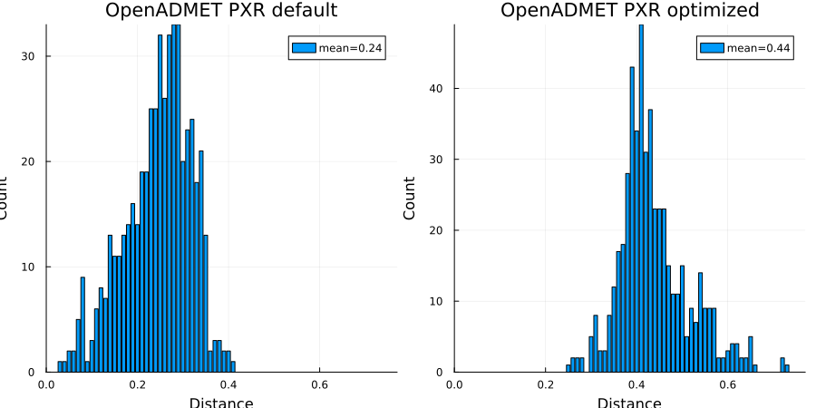

# train_test_split_optimise

`train_test_split_optimise` generates train/test splits that maximise the
separation between the two sets. It starts from a random split and repeatedly
tries swaps between one training item and one test item. A swap is accepted when
it improves the active objective.

The usual objective is the summed fingerprint distance between all cross-split
pairs. Optionally, one or more activity files can be supplied so the optimiser
also tries to preserve activity-bucket distributions in both sets.

## Input

The input is a TFDataRecord file containing serialized `nnbr::NearNeighbours`
protos, normally produced by `gfp_nearneighbours_single_file` or
`gfp_nearneighbours_single_file_tbb`.

The neighbour data must define symmetric pair distances. In normal use, generate
neighbours with a fixed distance threshold, not a fixed number of neighbours:

```shell
gfp_make.sh file.smi > file.gfp
gfp_nearneighbours_single_file_tbb -T 0.4 -h 8 -S file.nn file.gfp
```

The optimiser assumes that if molecule A has molecule B as a neighbour, the
corresponding B/A distance is also present or equivalently recoverable. A
fixed-count nearest-neighbour file usually violates that assumption and can give
incorrect optimisation behaviour. For very small tests, using `-n N-1` is
functionally equivalent because every molecule sees every other molecule.

Choose a threshold large enough that missing distances mean "too far away for
this split objective". Missing pair distances are assigned one more than the
largest stored distance.

## Basic Usage

```shell
train_test_split_optimise -f 0.8 -n 10 -S SPLIT -o 1000000 file.nn
```

This writes ten splits with 80% of the molecules in train. For split 0 the
output files are:

- `SPLITR0`: training identifiers.
- `SPLITE0`: test identifiers.
- `SPLITR0.smi`: training SMILES and identifiers.
- `SPLITE0.smi`: test SMILES and identifiers.

`R` denotes training and `E` denotes test, preserving long-standing LillyMol
naming used by related tools.

## Optimisation Controls

`-o <n>` sets the number of attempted swaps per split:

```shell
train_test_split_optimise -f 0.8 -n 3 -S SPLIT -o 2500000 file.nn
```

`-s <seconds>` runs each split for at least the specified number of seconds
instead of using a fixed optimisation count. `-o` and `-s` are mutually
exclusive.

`-x <n>` abandons optimisation when no accepted swap has occurred for `n`
consecutive attempts:

```shell
train_test_split_optimise -x 30000 -f 0.8 -n 3 -S SPLIT -o 2500000 file.nn
```

There is no universal best value for `-o`, `-s`, or `-x`. Use `-r <n>` to report
progress every `n` attempts and inspect how often accepted swaps are still being
found.

`-h <n>` sets the number of OpenMP threads used for expensive exact summary
calculations. Verbose mode performs extra calculations, so avoid `-v` for large
production runs unless the diagnostics are needed.

## Reproducibility

The optimiser starts from random train/test assignments and proposes random
swaps. Use `-Z seed=<n>` for reproducible splits:

```shell
train_test_split_optimise -Z seed=12345 -f 0.8 -n 1 -S SPLIT -o 1000000 file.nn
```

Use `-Z help` to list miscellaneous options.

## Activity-Aware Splitting

By default, optimisation only considers cross-split distances. Activity files can
be supplied so the optimiser also tries to preserve bucketised response
distributions in the train and test sets.

An activity file is a two-column table with a header record. The first column is
the molecule identifier and the second column is the activity value. Files whose
names end in `.csv` are parsed as comma-separated; other files are parsed as
space-separated.

Use `-A` to specify one or more activity files, and `-Y <weight>` to specify the
overall strength of the activity objective:

```shell
train_test_split_optimise -f 0.8 -n 3 -S SPLIT -o 1000000 \
  -A potency.txt:buckets=10 -Y 25 file.nn
```

`-A` and `-Y` are paired options. If activity files are specified without `-Y`,
initialisation fails rather than silently producing a distance-only split.
Similarly, `-Y` requires at least one activity file.

For each proposed swap, the combined objective is:

```text
combined_delta = distance_delta + Y * activity_delta
```

A positive `distance_delta` means cross-split separation improves. A positive
`activity_delta` means the activity bucket-distribution penalty decreases. The
swap is accepted only when the combined delta is positive.

### Activity Buckets

Activity values are bucketised independently for each activity file. Quantile
bucketisation is the default:

```shell
-A potency.txt:buckets=10
```

Equal-width buckets across the scaled activity range can be requested with
`width`:

```shell
-A potency.txt:buckets=10:width
```

Default settings can be changed for subsequent activity files:

```shell
-A buckets=8 -A assay1.txt -A assay2.csv:buckets=12:quantile
```

Per-assay options are colon-separated and include:

- `buckets=<n>`: number of activity buckets.
- `quantile`, `quantiles`, or `q`: bucket by sorted activity quantiles.
- `width`, `equal_width`, `range`, or `w`: bucket by equal-width scaled ranges.
- `bucket=<mode>` or `bucketisation=<mode>`: explicit bucketisation mode.
- `objective_weight=<n>` or `weight=<n>`: relative weight of this assay versus other assays.
- `tolerance=<percent>` or `tol=<percent>`: no-penalty range around each bucket's ideal train count.

The per-assay objective weight controls the relative importance of one assay
versus another. `-Y` controls the overall strength of the activity objective
versus the distance objective.

Missing activity values are allowed and ignored for that assay. Duplicate
activity identifiers are fatal. Activity records whose identifiers are absent
from the neighbour file are ignored and counted in verbose diagnostics. If all
observed values for an assay are identical, or bucketisation leaves only one
populated bucket, setup fails because the assay has no useful distribution to
preserve. Empty buckets are allowed but produce a warning.

## Sample Weights

`-C <fname>` reads sample counts as a two-column space-separated file with a
header record. The first column is the molecule identifier and the second column
is a positive integer count.

Sample counts affect distance scoring and activity-bucket penalties. Molecules
missing from the count file are treated as count 1.

## Cross-Split Summary

`-X` writes an additional cross-split distance summary for each split:

```shell
train_test_split_optimise -X -f 0.8 -n 1 -S SPLIT -o 1000000 file.nn
```

For split 0 this adds `SPLIT_stats0.txt`, with distance, count, and cumulative
count columns. With `-v`, the random initial split for split 0 is also written as
`SPLIT_stats_rand.txt`.

## Notes On Model Evaluation

Optimised distance splits can be much harder than random splits. They are useful
for stress-testing a modelling method or estimating performance on structurally
distant future molecules. They are not a substitute for a chronological split
when chronological data are available.

Using the BBB dataset from
[Kaggle](https://www.kaggle.com/datasets/sachinkg7/bbbp-dataset-ai-project),
SVM fingerprint models built with random 80/20 splits gave AUC values around
0.95. Using designed splits from this tool reduced AUC to about 0.74.

The figure below shows the distribution shift induced by an optimised split:


A later PXR example compared a scaffold split with an optimised split:



The commands used for that example were:

```shell
cat train.smi test.smi > all.smi
gfp_make.sh all.smi > all.gfp
gfp_nearneighbours_single_file_tbb -S all.nn -T 0.45 -h 8 all.gfp
train_test_split_optimise -f 0.8897 -n 1 -S SPLIT -o 20000000 -r 50000 -x 20000 -h 8 -v all.nn
```

The `0.8897` value replicates the train/test partition size in the originally
specified split.

A more specific example is available in
[Workflow](/docs/Workflows/train_test_split_optimise.md).
