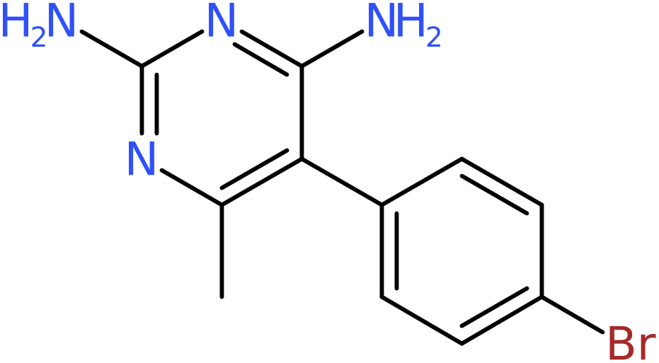
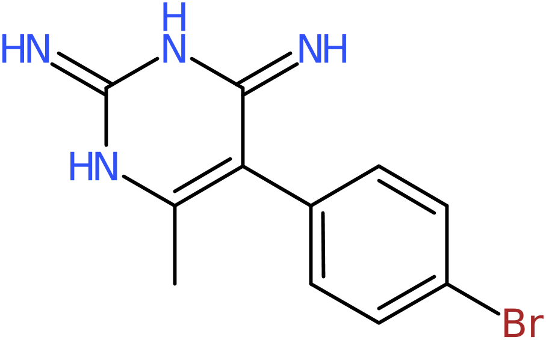
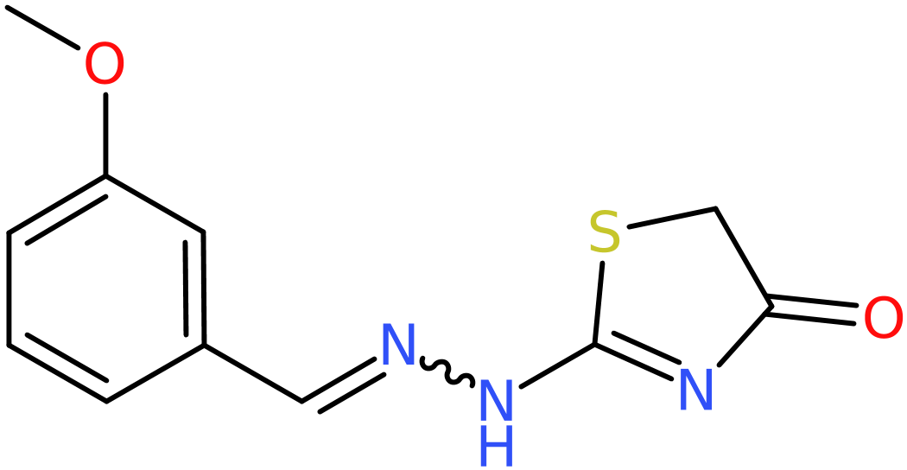
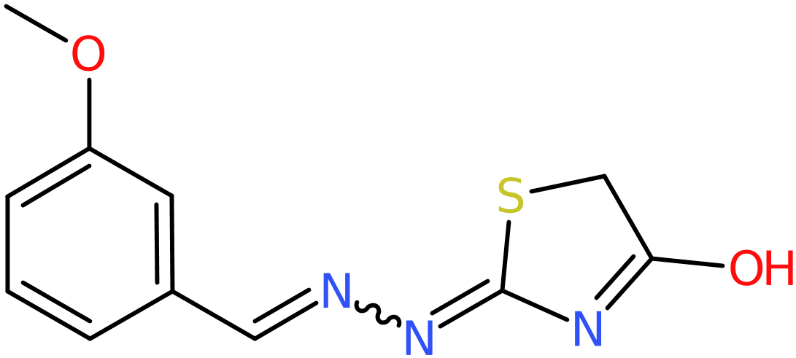
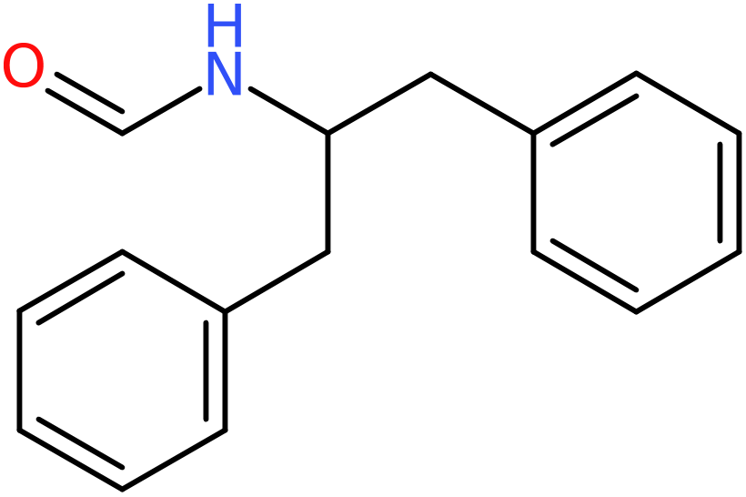
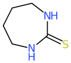
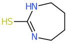

# InChI

## TLDR
LillyMol can support reading and writing InChI. It can also write InChI keys.
Make sure you understand the
implications for both run-times and tautomerisation before using.

## LillyMol InChI

If the shell variable BUILD_INCHI is set during the build process, LillyMol executables
will include the ability to read and write InChI. To manually build with InChI something
like
```bash
bazelisk build --config=inchi ... Molecule_Tools:fileconv
```
will work. At the time of writing only [fileconv](fileconv.md) and
[unique_molecules](unique_molecules.md) have support for InChI.

```bash
fileconv -o inchi ... file.smi
```
will generate `file.inchi`. That file can then be read
```
fileconv file.inchi
```
will create `file.smi`, but see below for round trips.

Using
```bash
fileconv -o inchikey file.smi
```
will generate `file.inchikey` which has the InChI key as the first token, then any
name tokens.

Note that the resulting executables will have a run-time library dependency for InChI which
you will need to manage via LD_LIBRARY_PATH.

## Round Trips

InChI makes various tautomeric like transformations to the molecules it reads. These
transformations are very similar to the chemical standardisation transformations built
into LillyMol.

Applying transformations is one of the features that enables InChI to identify
equivalent structures - same objective as LillyMol.

But unfortunately many of the transformations applied by InChI are different from
the transformations applied by LillyMol. So, a round-trip transformation from 
SMILES->InChI->SMILES will not reconstruct the starting molecules.

For example, given 1000 random Chembl molecules, 104 do not produce the starting
smiles during a round trip conversion.

These include things like



are transformed to



by InChI.

and 



which is converted to



which again is not converted back to its original form by any of the default
standardisations in LillyMol.

Also



which is converted to


which again is not converted back to the starting form via default transformations
built into LillyMol

Given this molecule in thione form



InChI will transform that molecule to the thiol form



If given both forms, InChI will result in the two molecules being classified as
identical. Same as LillyMol standardisation - if no standardisation is used, the
molecules remain different. RDKit santitization retains the molecules as distinct.
Chemical standardisation in LillyMol (-g all) will convert the thiol form back to thoine form.
While in this particular case, the LillyMol convention might be closer to reality,
the primary objective of LillyMol standardisation is more about obtaining
consistency across molecules.

I don't know how InChI localises the Hydrogen in the thiol form, presumably
it is doing some kind of canonical assignment. The chemical standardsiation
built into LillyMol also assigns various normalised forms based on a canonical
placement.

While people do quantum calculations to determine likely tautomeric forms,
simple Cheminformatics tools like LillyMol and InChI are clearly incapable
of replicating such precision.

For broad based structure equivalence determinations, InChI is clearly a good tool. But
this comes at a cost. For example running 50k random Chembl molecules through
```
fileconv -o inchi -S - rand50k.smi
```
takes 5.8 seconds, whereas running
```
fileconv -o usmi -g all -S - rand50k.smi
```
takes 1.5 seconds.

## unique_molecules.
If built in the presence of BUILD_INCHI, this tool can use InChI keys as the 
uniqueness determination. As an experiment start with Chembl 33 and remove
some likely less interesting molecules
```
fileconv -C 60 -c 2 -O def -f lod -I 0 -S /tmp/chembl -v -E autocreate -V /home/ian/CHEMBL/chembl_33.smi
```
Molecules will have between 2 and 60 atoms, Organic only, largest fragment, no isotopes and no
valence errors. This results in 2.287M molecules.

Running unique_molecules with all default options, except for adding the -C option to use InChI comparisons,
takes 304 seconds and results in 107,210 duplicates.

Omitting the -C option, and using the default unique smiles, results in an 88 second run-time with
106,872 duplicates identified. If LillyMol chemical standardisation is also applied, the run time
increases to 102 seconds, and now 116,783 duplicates are found.

We can examine some of these discrepancies. For example a set of duplicates detected by
LillyMol include
```
OO CHEMBL71595
[O-][O-] CHEMBL3707298
```
which become identical once LillyMol chemical standardisation is applied - most charges
are neutralised. Same for
```
C(=O)C(=O)O CHEMBL1162545
C(=O)([O-])C=O CHEMBL3986754
```
So many of the duplicates that are detected by LillyMol are due to the standardisation
steps applied by the '-g all' option to LillyMol.

Some of the differences are due to invalid chiral centres - the process above did not
remove them.

The topic of tautomeric treatment in InChI and LillyMol is large and complex.

## Summary
Using InChI, or InChI keys might be useful in some situations, but there do appear
to be some significant limitations. Run times are poor in comparison with LillyMol
unique smiles, and the handling of formal charges may, or may not, be desirable.

By default, LillyMol does not change any tautomeric form. If LillyMol standardisation
is applied, tautomeric forms are normalised. InChI always applies its own tautomer
normalisation operations. These are different in interesting ways.
