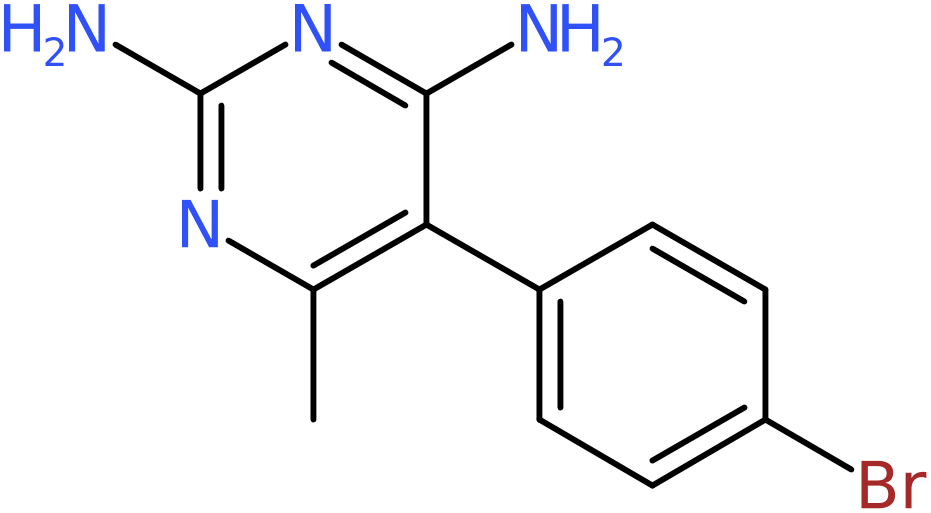
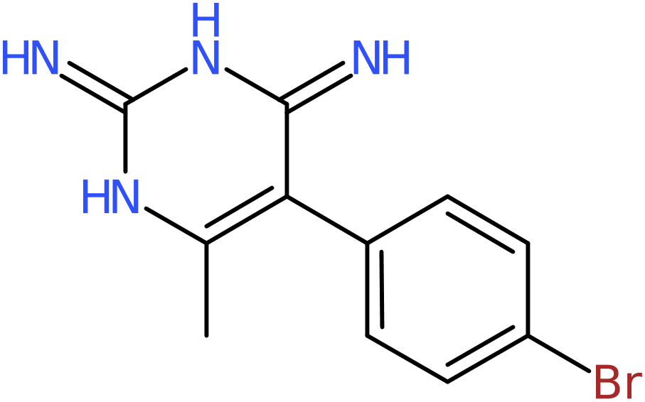
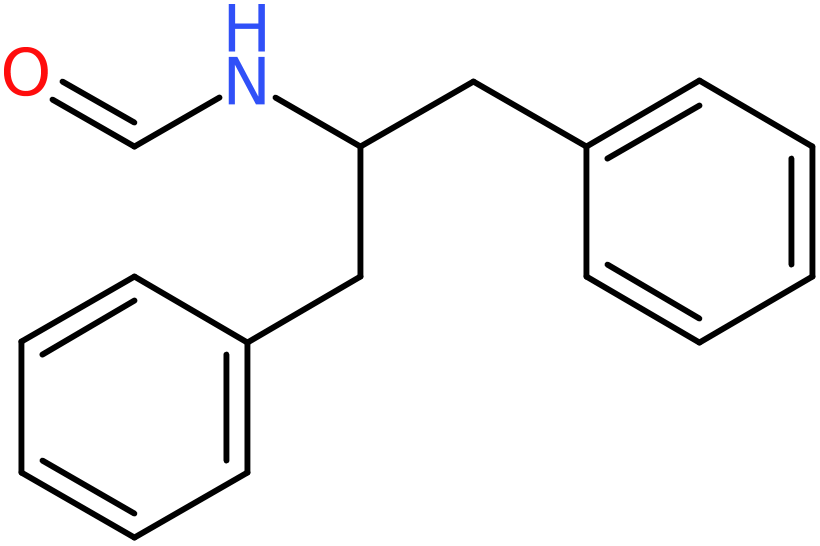

# InChI
If the shell variable BUILD_INCHI is set during the build process, LillyMol executables
will include the ability to read and write InChI.

Note that the resulting executable will have a run-time library dependency for InChI which
you will need to manage.

This brings up some interesting issues.

InChI makes various tautomeric like transformations to the molecules it reads. These
transformations are very similar to the chemical standardisation transformations built
into LillyMol.

Applying transformations is one of the features that enables InChI to identify
equivalent structures - same objective as LillyMol.

But unfortunately many of the transformations applied by InChI are different from
the transformations applied by LillyMol. So, a round-trip transformation from 
SMILES->InChI->SMILES will not reconstruct the starting molecules.

For example, given 1000 random Chembl molecules, 104 do not produce the starting
smiles during a round trip conversion.

These include things like

are transformed to

by InChI.

and 

which is converted to

which again is not converted back to its original form by any of the default
standardisations in LillyMol.

Also

which is converted to

which again is not converted back to the starting form via default transformations
built into LillyMol

For broad based structure equivalence determinations, InChI is clearly a good tool. But
this comes at a cost. For example running 50k random Chembl molecules through
```
fileconv -o inchi -S - rand50k.smi
```
takes 5.8 seconds, whereas running
```
fileconv -o usmi -g all -S - rand50k.smi
```
takes 1.5 seconds.

## unique_molecules.
If built in the presence of BUILD_INCHI, this tool can use InChI keys as the 
uniqueness determination. As an experiment start with Chembl 33 and remove
some likely less interesting molecules
```
fileconv -C 60 -c 2 -O def -f lod -I 0 -S /tmp/chembl -v -E autocreate -V /home/ian/CHEMBL/chembl_33.smi
```
Molecules will have between 2 and 60 atoms, Organic only, largest fragment, no isotopes and no
valence errors. This results in 2.287M molecules.

Running unique_molecules with all default options, except for -C to use InChI takes
304 seconds and results in 107210 duplicates.

Omitting the -C option, and using the default smiles, results in an 88 second run-time with
10687 duplicates identified. If LillyMol chemical standardisation is also applied, the run time
increases to 102 seconds, and now 116783 duplicates are found.

We can examine some of these discrepancies. For example a set of duplicates detected by
LillyMol include
```
OO CHEMBL71595
[O-][O-] CHEMBL3707298
```
which become identical once LillyMol chemical standardisation is applied - most charges
are neutralised. Same for
```
C(=O)C(=O)O CHEMBL1162545
C(=O)([O-])C=O CHEMBL3986754
```
So many of the duplicates that are detected by LillyMol are due to the standardisation
steps applied by the '-g all' option to LillyMol.

Some of the differences are due to invalid chiral centres - the process above did not
remove them.

## Summary
Using InChI, or InChI keys might be useful in some situations, but there do appear
to be some significant limitations. Run times are poor in comparison with LillyMol
unique smiles, and the handling of formal charges may, or may not, be desirable.

I looked for instances where the differences were due to subtle tautomeric issues
but was not able to readily identify such cases - most of the differences are due to
charges. But I believe such cases will exist, and would be interesting.
