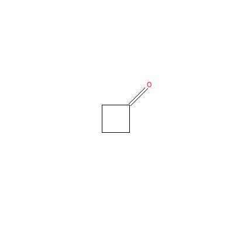
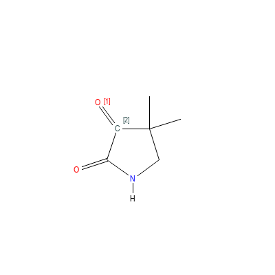
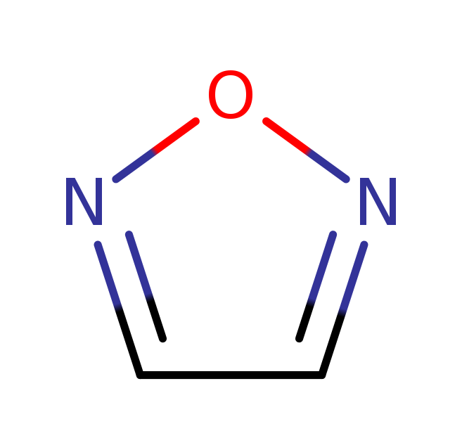
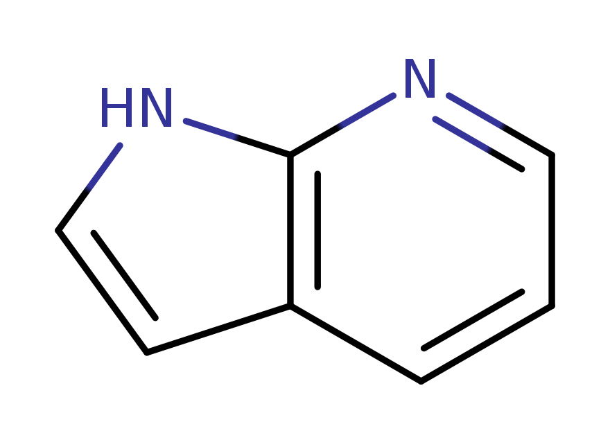
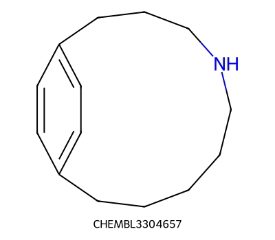

# Substructure Searching

LillyMol provides a great deal of flexibility for substructure searching.

Query information can be specified via several means

* SMARTS
* historical query file
* textproto query file
* ISIS query file
* Some Chemaxon SMARTS extensions

## Contents

* [SMARTS](#smarts)
* [Extensions](#extensions)
* [Atomic SMARTS Extensions](#atomic-smarts-extensions)
* [Ring Bond Count](#ring-bond-count)
* [LillyMol `/IW...` atomic SMARTS extensions](#lillymol-iw-atomic-smarts-extensions)
* [Future `/IW` directives](#future-iw-directives)
* [Other Messages](#other-messages)
* [Choosing between environment, down_the_bond, and Substituent](#choosing-between-environment-down_the_bond-and-substituent)
* [Down The Bond](#down-the-bond)
* [Substituent](#substituent)
* [Region](#region)
* [MatchedAtomMatch](#matchedatommatch)
* [Preference Values](#preference-values)

## SMARTS

This is the most common query form used. LillyMol's implementation of SMARTS
is generally compatible with other implementations. It contains several useful
extensions to SMARTS.

## Extensions

### Numeric Qualifiers

Numeric qualifiers constrain the number of times a SMARTS component must match
the target molecule. They are especially useful when preparing reagents for
enumeration, where it is often necessary to identify molecules with exactly one
instance of a functional group, or to exclude molecules with unwanted groups.

| Form | Meaning |
| --- | --- |
| `1[OH]-C=O` | exactly one carboxylic acid match |
| `1[OH]-C=O&&0[OH]-S(=O)=O` | one carboxylic acid and no sulfonic acids |
| `0P` | no phosphorus atoms |
| `<4[#16]` | fewer than four sulfur atoms |
| `4-10[#7]` | between four and ten nitrogen atoms |

The numeric qualifier applies to the number of embeddings found for the SMARTS
component. This matters for symmetric groups and rings, as described below.

#### Caution

Numeric qualifiers count embeddings, not chemical groups. Symmetric SMARTS can
therefore produce more matches than the number of functional groups a chemist
would count.

For example, if you want molecules with exactly one nitro group, this will not
work:

```text
1O=N=O
```

The representation is symmetric, so one nitro group gives two embeddings. In
default matching mode, this query matches molecules with exactly one nitro
group:

```text
2O=N=O
```

The same issue appears with aromatic rings. In default matching mode,
`12c1ccccc1` matches molecules with exactly one benzene ring.

Several options change the number of embeddings reported:

* `tsubstructure -u` uses unique embeddings. With this option, each benzene ring
  returns one match.
* One embedding per start atom, `-r` in `tsubstructure`, stops searching from a
  start atom after the first match. With this option, benzene gives six matches.
* `-M edno` in `tsubstructure` discards embeddings that overlap previously found
  embeddings.

Symmetry is not the only source of extra embeddings. If looking for an amide
with `N-C=O`, a urea group matches twice. Possible responses include:

* rewrite the SMARTS as `O=C-N` and use one embedding per start atom;
* use `-M edno` if overlapping embeddings are not wanted;
* use a recursive SMARTS that does not report the nitrogen atom as matched;
* use a query-file `environment_no_match` condition.

A recursive SMARTS such as `O=[$([CD3]-N)]` does not report the nitrogen atom as
a matched atom. That may be fine for filtering, but it is not suitable when the
matched atoms are needed. It also does not solve the urea problem unless the
recursive SMARTS is extended, for example:

```text
O=[$([CD3](-N)-[!N])]
```

Differentiating an amide from a urea can also be done with an
`environment_no_match` directive in a query file.

```textproto
query {
  smarts: "O=[CD3]-[NG0]"
  environment_no_match {
    attachment {
      attachment_point: 1
      btype: SS_SINGLE_BOND
    }
    smarts: "N"
  }
}
```

But note that this query will match molecules like

which contain both a urea and an amide that share a nitrogen atom. We can also
exclude matches where there is another `C=O` attached to the matched nitrogen.

```textproto
query {
  smarts: "O=[CD3]-[NG0]"
  environment_no_match {
    attachment {
      attachment_point: 1
      btype: SS_SINGLE_BOND
    }
    smarts: "N"
  }
  environment_no_match {
    attachment {
      attachment_point: 2
      btype: SS_SINGLE_BOND
    }
    smarts: "C=O"
  }
}
```

The first `environment_no_match` checks what is attached to matched atom 1, the
carbon atom. The second checks what is attached to the nitrogen atom. This could
also be accomplished by recursive SMARTS, but at the cost of considerable
complexity if primary, secondary and tertiary amides are to be handled.

```text
O=C([$([!N])])-[$([ND1]),$([ND2]-[!$(C=O)]),$([ND3](-[!$(C=O)])-[!$(C=O)])]
```

This case points to the fact that within LillyMol
substructure searching there are frequently many different ways of
doing the same thing. These will differ in their complexity, and
efficiency.

In the case above, the query file processes 20k molecules in 0.65 seconds
whereas the SMARTS-based query takes 10% longer.

### Logical Operations

A LillyMol SMARTS query can be either a normal SMARTS, such as `C`, `N`, or
`c1ccccc1`, or a logical expression combining multiple SMARTS components. This
uses notation similar to atomic SMARTS logical expressions.

| Form | Meaning |
| --- | --- |
| `A&&B` | high-priority AND; both components must match |
| `A||B` | OR; the first matching component succeeds |
| `A^^B` | XOR; exactly one component must match |
| `A;;B` | low-priority AND, useful in more complex expressions |
| `A.B` | normal SMARTS dot; components are part of one embedding and must match distinct atoms |

The high-priority AND and low-priority AND terminology follows the Daylight
convention. The most important distinction here is between logical AND and the
normal SMARTS dot.

```text
C&&[R]
```

matches any molecule that contains an aliphatic carbon atom and an atom in a
ring. These may be the same atom. The two components are evaluated independently:
first “does the molecule contain an aliphatic carbon?”, then “does the molecule
contain an atom in a ring?”. There is no embedding-level relationship between the
left and right sides.

By contrast,

```text
C.[R]
```

is a normal SMARTS with two components. It requires an aliphatic carbon atom and
a different atom that is in a ring.

There is an important caveat when matched atoms are returned from logical
expressions. The matched atoms come from the component that was actually
evaluated and returned the result. For example, with `[#6]||[#7]`, if the
molecule contains carbon, the nitrogen query is not evaluated and the returned
matched atom is the first carbon atom. With `[#6]&&[#7]`, the returned matched
atom will be from the second component, the nitrogen query.

If the query is instead written as

```text
[#6].[#7]
```

each result contains two matched atoms, the first carbon and the second nitrogen.
Those atoms are necessarily different.

The XOR operator is supported. For example, `Cl^^Br` matches molecules that have
either chlorine or bromine, but not both.

The most common use is the OR operator, where multiple queries for a reagent may
cover slightly different reagent types. Since OR evaluation stops after the first
matching component, put the preferred or most reactive group first if the matched
atoms will be used later.

For example, to perform a reaction that should use a primary amine first, then a
secondary amine, then an aniline:

```text
[NH2]-[CX4]||[ND2HR0](-[CX4])-[CX4]||[NH2]-a
```

The most reactive group is preferentially returned by the query.

### Environments

Environment directives describe atoms attached to an existing match. There is an
important distinction between query-level environments and ring/ring-system
environments.

For a query-level `environment` or `environment_no_match`, the first atom in the
environment SMARTS is outside the main SMARTS embedding. It is joined to one of
the matched atoms named by `attachment_point`.

For an environment inside a `ring_specifier` or `ring_system_specifier`, the
first atom in the environment SMARTS is an atom in the ring or ring system. The
rest of the environment describes what is attached to that ring/system atom.

Consider the need for a cyclic ketone such as

but where molecules with adjacent `C=O` groups

must be excluded.

This can be done with recursive SMARTS:

```text
O=[CD3RT1]([!$([#6]=O)])[!$([#6]=O)]
```

A query file can express the same idea more explicitly.

```textproto
query {
  smarts: "O=[CD3RT1]([#6:2])[#6:3]"
  environment_no_match {
    smarts: "O"
    attachment {
      attachment_point: [2, 3]
      btype: SS_DOUBLE_BOND
    }
  }
}
```

Here the main SMARTS includes the adjacent carbon atoms as matched atoms 2 and
3. The `environment_no_match` says that the overall query fails if an oxygen atom
is doubly bonded to either of those atoms. Because the adjacent carbon atoms are
explicitly included in the SMARTS, the `T1` directive is not essential in this
example.

#### Electron withdrawing groups

Consider a phenol with an ortho or para electron withdrawing group chosen from a
list. This could be done with recursive SMARTS, but it quickly becomes difficult
to read. A query file can make the intent clearer.

```textproto
name: "phenol + ewd"
query {
  smarts: "[OH]-c1:c:[cD2]c[cD2]c1"
  environment {
    smarts: "N(=O)=O"
    smarts: "C=O"
    smarts: "C#N"
    smarts: "[F,Cl,Br,I]"
    smarts: "S(=O)=O"
    attachment {
      attachment_point: [2, 4, 6]
      btype: SS_SINGLE_BOND
    }
    no_other_substituents_allowed: true
    hits_needed: 1
  }
}
```

The SMARTS looks for a phenol with substitution allowed only at the ortho and
para positions. The environment lists possible sidechains attached by a single
bond to matched atoms 2, 4, or 6. Each sidechain SMARTS is written with the atom
joined to the phenol first.

`no_other_substituents_allowed: true` rejects other substituents at those sites.
`hits_needed: 1` means that across the three possible attachment points, exactly
one site must match one of the listed environments.

### Large recursive SMARTS

SMARTS has been referred to as a write-only language, with extraordinarily
complex SMARTS being written by experts. These create maintenance
nightmares for those who follow. While LillyMol does support complex
recursive SMARTS, many of the extensions are designed to help
avoid them.

That said, the contrib directory contains a Python script, `mkbenzene`,
that will generate an arbitrarily sized recursive SMARTS for
benzene. LillyMol has
successfully performed a substructure search on a 2 MB recursive
smarts generated by this tool. Took 4 seconds.

Here is what that SMARTS might look like; the generated example used for the
search was about 2 MB.

```text
[$(c%66[$([0#6H1r6R1D2X3x2+0a]%35[$([0#6H1r6R1D2X3x2+0a]%11[acr6][$([acr6]%14[cH1a][cX3H][0#6+0a]c[ac]%14)][cH1a]c[ch]%11)][acr6][$([$(cc)]%15[cR1]c[0#6+0a][cH1a][#6aH]%15)][cR1]c%35)][$([cR1]%59[ch][c^n][#6aH][$([cR1]%69[#6aH][0#6+0a]c[cD2][$([cR1]%24[acr6][ac][cH1a][cX3H][$(cc)]%24)]%69)][$(cc)]%59)][$([ch]%91[0#6H1r6R1D2X3x2+0a][x2Hc][c^n][$(c%38[c^n][ch][ac][cH1a][cX3H]%38)][cX3H]%91)][$([0#6H1r6R1D2X3x2+0a]%53[ch][acr6][ac][cD2][$(cc)]%53)]c%66)] #10
```
Generate this with:

```shell
mkbenzene.py --write_last --nsmarts 50000 > /tmp/50000.smt
```
and test with:

```shell
time tsubstructure -q S:/tmp/50000.smt benzene.smi
```
which should record one match.

### Linker Groups

Linker groups can be expressed with the `...` construct. It means that there
must be a path between the atoms on either side, but no atoms on that path are
reported as matched atoms. This is useful for imposing separation or linker
composition constraints without adding the linker atoms to the embedding.

For example, to find amides that face away from each other:

```text
NC(=O)...C(=O)N
```

The linker can also include qualifiers in braces.

| Form | Meaning |
| --- | --- |
| `A...B` | a linker path between `A` and `B`; linker atoms are not reported as matched atoms |
| `A...{>3}B` | more than 3 bonds between `A` and `B` |
| `A...{>3;0[c]}B` | more than 3 bonds, and no aromatic carbon in the linker |

Multiple linker qualifiers are separated by `;` and are combined as an implicit
AND. The exact set of supported qualifiers is shared with the underlying
`NoMatchedAtomsBetween` implementation.

More examples are available in the C++ unit tests
[substructure_nmab_test.cc](/src/Molecule_Lib/substructure_nmab_test.cc), and
some implementation notes remain in [substructure.h](/src/Molecule_Lib/substructure.h).

A current limitation is that `...` constructs cannot be inside parentheses.
Something like `CC(...N)C` does not work. This will be addressed.

Whether it is better to express a complex linker relationship in SMARTS or via a
query file is an open question.

## Atomic SMARTS Extensions

LillyMol's atomic SMARTS also contain some useful extensions.

### Relational Conditions

Most atomic properties support `<` and `>` modifiers.

| Form | Meaning |
| --- | --- |
| `[CD>2]` | carbon with more than two connections |
| `[>0]` | any isotopic atom |
| `[CT<2]` | carbon with fewer than two attached heteroatoms |

Relational conditions are not currently supported for atomic number or formal
charge. For example, `[#<17]` is not supported. It could be implemented if
needed, but atomic number matching is common enough that adding extra checks
would affect a frequently used path.

### Arbitrary Elements

LillyMol can treat arbitrary one- or two-letter tokens as elements. These tokens
do not have an atomic number, mass, valence, or other chemical properties, but
they can be matched. Enable all one- and two-letter combinations with
`-E autocreate`.

LillyMol elements can also have arbitrary length. With `-E anylength`, input such
as `[Ala][Leu][Gly]` can be read and searched as atom-like symbols.

```text
[#{Ala}]-[#{Leu}]-[#{Gly}]
```

More generally, peptide-like strings can be searched with queries such as:

```text
[#{Ala}]-*-*-[#{Glu}]-[#{Cys}]
[#{Ala}]...{4-8}[#{His},#{Leu}]-[#{Ile}]
```

This can be useful when treating non-standard tokens, such as residues, as
atom-like symbols rather than normal chemical atoms.

### Attached heteroatom count

Chemists often formulate an atom constraint as "carbon or hydrogen", which is
problematic when hydrogens are implicit. Often the intended constraint is really
on the number of heteroatoms attached to a particular atom. The `T` directive
matches attached heteroatom count.

| SMARTS | Meaning |
| ------ | ------- |
| `[CT0]` | carbon atom with no attached heteroatoms |
| `[CT<2]` | carbon atom with zero or one attached heteroatom |
| `[CT{0-1}]` | equivalent range form for zero or one attached heteroatom |

Most atomic properties support the RDKit-style range specifier, as in
`[CT{0-1}]`.

### Unsaturation

The `G` directive matches degree of unsaturation without tying the constraint to
a particular atom type. Aromatic atoms are considered unsaturated.

| SMARTS | Meaning |
| ------ | ------- |
| `[G0]` | fully saturated atom of any kind |
| `[G>0]` | atom with some degree of unsaturation |
| `[G1]` | atom with one unit of unsaturation, commonly one attached double bond |
| `[G2]` | atom with two units of unsaturation, such as an attached triple bond |

## Ring Bond Count

In SMARTS, `@` marks a ring bond. LillyMol also allows multiple `@` symbols to
constrain the number of rings that include the bond.

| SMARTS | Meaning |
| ------ | ------- |
| `C@C` | carbon-carbon bond in any number of rings |
| `C@@C` | carbon-carbon bond included in exactly two rings |
| `c@@c` | aromatic bond included in exactly two rings, such as a ring-fusion bond |

For example, `C@@C` matches adamantane and `c@@c` matches the ring-fusion bond in
naphthalene.

There is currently a discrepancy in how ring information is counted for atoms and
bonds. The `nrings` attribute for an atom is the number of SSSR rings including
that atom. The `nrings` attribute for a bond may also include certain non-SSSR
rings. For atoms, the ring bond count is generally preferred.

For simple fused systems, which do not have non-SSSR rings, this discrepancy will
not matter.

There is no bond-level way to specify that a bond is in exactly one ring. Use the
ring bond count attribute on the atoms instead. `[cx3]:[cx3]` is often similar to
`c@@c`, but there are edge cases where they differ.

## LillyMol `/IW` atomic SMARTS extensions

As LillyMol gained more substructure features, single-letter SMARTS extensions
became too limiting. LillyMol therefore supports `/IW...` atomic SMARTS
extensions for features that do not fit naturally into standard SMARTS syntax.

The following `/IW` atomic SMARTS extensions are recognised.

* /IWrid
* /IWfsid
* /IWfss
* /IWVy
* /IWAr
* /IWspch /IWscaf
* /IWhr /IWrh
* /IWrscb
* /IWsymd
* /IWsymg
* /IWKl
* /IWorganic
* /IWnonorganic
* /IWspiro
* /IWcipR /IWcipS
* /IWNv
* /IWgid
* /IWx

### /IWrid

`/IWrid` assigns a ring id requirement to a query atom. Query atoms with the same
ring id must match atoms in the same ring.

For example, this query matches molecules with two aromatic nitrogen atoms in the
same ring.

```text
[/IWrid1n].[/IWrid1n]
```

Molecules such as  match.

Different ring ids require different rings. This query matches two aromatic
nitrogen atoms in different rings.

```text
[/IWrid7n].[/IWrid2n]
```

Molecules such as  match. Those nitrogen
atoms are in different rings, but in the same ring system. See `/IWfsid` below
for ring-system matching.

Specifying a ring id also means that the query atom must match a ring atom.
Earlier LillyMol versions did not enforce this, but that behaviour was contrary
to normal user expectations.

### /IWfsid

`/IWfsid` assigns a fused-system id requirement to a query atom. Query atoms with
the same fused-system id must match atoms in the same fused ring system.

For example, this query matches molecules with two aromatic nitrogen atoms in the
same fused system, but in different rings.

```text
[/IWfsid1/IWrid1n].[/IWfsid1/IWrid2n]
```

The fused-system ids must match and the ring ids must differ.

When written directly in SMARTS, both `rid` and `fsid` values are limited to
single digits. That limitation is lifted in a query textproto file.

### /IWfss

`/IWfss` matches fused-system size, defined as the number of rings in a fused ring
system. For example, this query matches a fused aromatic bicyclic system with an
`NH2` group on one ring and a halogen on the other ring.

```text
[/IWfss2/IWfsid1/IWrid1a]-[NH2].[/IWfsid1/IWrid2a]-[Cl,Br,I]
```

It matches molecules such as , including
5,5-, 5,6-, and 6,6-fused systems.

### /IWspiro

`/IWspiro` matches spiro-fusion atoms. The same idea can be expressed with ring
ids, but the SMARTS is more verbose.

```text
[/IWrid1R]@[CD4x4](@[/IWrid1])(@[/IWrid2])@[/IWrid2]
```

The atoms on the left are in ring id 1 and the atoms on the right are in ring id
2. `[/IWspiro]` is usually simpler.

By default, LillyMol ring systems do not extend across spiro fusions. This means
that fused-system size does not cross a spiro atom. For example:

```text
[/IWfss1/IWrid1]@[/IWspiro]@[/IWfss1/IWrid2]
```

This matches spiro fusions with a single ring on either side. The fused-system
size directives apply separately to each side of the spiro fusion.

### /IWcipR /IWcipS

`/IWcipR` and `/IWcipS` provide rudimentary support for Cahn-Ingold-Prelog stereo
designators in `trxn`. The implementation does not currently do shell expansion.

### /IWspch /IWscaf

`/IWscaf` matches atoms in the scaffold. `/IWspch` matches atoms in the spinach,
the complement of the scaffold.

For example, this query matches an amide carbonyl carbon in the scaffold, such as
an amide in a region between rings.

```text
[/IWscaf1C](=O)!@N
```

The equivalent spinach form is:

```text
[/IWspch0C](=O)!@N
```

### /IWrscb

`/IWrscb` matches the number of scaffold bonds attached to a ring atom. This is
useful for distinguishing terminal rings from more internal scaffold rings.

A terminal ring has only one chain connection to the rest of the scaffold, so
`[/IWrscb1]` matches atoms in a terminal ring. An atom in a more internal ring may
need a higher value, such as `[/IWrscb2a]-F`. Increasing the value matches atoms
in rings with more scaffold connections.

### /IWhr /IWrh

`/IWhr` and `/IWrh` constrain the number of heteroatoms in a ring containing the
matched atom. The matched atom itself contributes to the heteroatom count if it is
a heteroatom.

For example, `[/IWhr1n]` matches pyridine. The query `[/IWhr>2nD3]` matches an
aromatic nitrogen that is three-connected and is in a ring with three or more
heteroatoms, including that nitrogen.


In that example, the required heteroatom count is achieved by two nitrogen atoms
and one oxygen atom. Aromaticity is not implied by `/IWhr` or `/IWrh`; specify
aromaticity separately when needed.

Ring heteroatom count can be subtle in fused rings. For example, when looking for
large carbocyclic rings, `[/IWrh0r>7]` seems reasonable, but it matches a molecule
such as .

The reason is that `/IWrh0` and `r>7` are evaluated independently. Atoms in the
six-membered carbocyclic ring match `/IWrh0`. Some of those same atoms also match
`r>7` because they are also in the larger ring, which is not carbocyclic.

One workaround is to restrict the match to atoms in exactly one ring.

```text
[/IWrh0r>7R1]
```

A query file can express the ring requirement more directly.

```textproto
query {
  ring_specifier {
    base {
      heteroatom_count: 0
    }
    min_ring_size: 8
  }
}
```

Even then, beware of SSSR effects in complex fused systems. `/IWrh` is useful in
simple cases, but fused rings require care.

### /IWorganic /IWnonorganic

LillyMol has the concept of an organic element. By default, these are C, N, O, F,
S, P, Cl, Br, and I. `[/IWorganic]` matches any of those elements, and
`[/IWnonorganic]` matches anything else.

### /IWVy

`/IWVy` matches atoms adjacent to a vinyl-like group: one adjacent atom is
unsaturated. Aromatic atoms are not considered unsaturated for this directive.
Note that LillyMol has more than one internal definition of unsaturation; newer
work excludes aromatic atoms in this context.

### /IWAr

`/IWAr` matches atoms adjacent to an aromatic atom. In many cases, ordinary SMARTS
such as `[....]~a` or a recursive SMARTS is clearer. This check uses an intrinsic
property of the atom and does not consider whether the adjacent aromatic atom has
already been matched by another part of the query.

### /IWsymd

`/IWsymd` matches atom symmetry degree. An atom that is not symmetric with any
other atom in the molecule has symmetry degree 1. The fluorine atoms in `CF3`
have symmetry degree 3. This property is relatively expensive to compute.

### /IWsymg

`/IWsymg` assigns a symmetry-group requirement. All query atoms with the same
symmetry-group id must match symmetric atoms.

For example, this query matches two symmetric methoxy groups.

```text
[/IWsymg1OD2]-[CH3].[/IWsymg1OD2]-[CH3]
```

It matches molecules such as .

To find well separated symmetric atoms, use a linker constraint with the same
symmetry-group id at both ends.

```text
[/IWsymg1]...{>12}[/IWsymg1]
```

This matches molecules such as .

### /IWgid

`/IWgid` is used with the `set_global_id` directive in a query file. It is a
bridge between global pre-match requirements and later SMARTS atom matching.

A `Query` message can contain `ring_specifier` and `ring_system_specifier`
messages. These define rings or ring systems that must be present in the target
molecule. They are evaluated before the main SMARTS atom matching is attempted.
Without extra communication, the SMARTS part of the query does not know which
ring or ring system satisfied those requirements.

`set_global_id` provides that communication. When a ring or ring system matches,
LillyMol assigns the chosen global id to atoms in that matched ring or ring
system. A later SMARTS can then use `/IWgidN` to require an atom with that global
id. The numbers are arbitrary labels chosen by the query writer; they are not
intrinsic molecular properties.

When `/IWgidN` is written directly in a SMARTS string, `N` is restricted to a
single digit. In a textproto query file, arbitrary integer global ids can be
used.

For example, suppose we are looking for a methoxy attached to the six-membered
ring of a 5,6 fused aromatic system. The query file might look like:

```textproto
name: "methoxy on 6 ring in 5,6 fused aromatic"
query {
  ring_system_specifier {
    rings_in_system: 2
    aromatic_ring_count: 2
    ring_size_requirement {
      ring_size: 5
      count: 1
    }
    ring_size_requirement {
      ring_size: 6
      count: 1
    }
    base {
      set_global_id: 4
    }
  }
  smarts: "[/IWgid4r6a]O[CD1]"
}
```
which matches molecules like


Note that in this particular case, the same **overall** effect could be
achieved by using an environment within the `ring_system_specifier`,
but those matches do **not** match any atoms - ring system requirements
are implemented as a pre-match filter before atom matching is done.
The `set_global_id` functionality makes such atoms available for matching
during atom matching and therefore available in
reactions and other matched atom specific needs.

#### Marking environment and substituent atoms

By default, `base { set_global_id: N }` marks the atoms in the matched ring or
ring system. Sometimes the atom of interest is not in the ring/system itself,
but is attached to it. Two related mechanisms handle that case.

If a ring or ring-system environment is present, `environment_sets_global_id:
true` causes atoms matched by the environment to also receive the global id.

```textproto
query {
  ring_specifier {
    aromatic: true
    base {
      set_global_id: 1
      environment: "[OD1]"
      environment_sets_global_id: true
    }
  }
  smarts: "[/IWgid1O]"
}
```

A matched `Substituent` can also assign a global id to the atoms in that
substituent.

```textproto
query {
  ring_specifier {
    aromatic: true
    base {
      substituent {
        length: 1
        required_smarts: "[OD1]"
        set_global_id: 2
      }
    }
  }
  smarts: "[/IWgid2O]"
}
```

These forms make the sidechain atoms visible to the later SMARTS match. In
summary, global ids can mark atoms in the matched ring/ring system, atoms
matched by a ring/ring-system environment, or atoms in a matched substituent.

### /IWKl

`/IWKl` matches an atom only if all rings containing that atom are likely to have
different Kekule forms. This is specialised functionality that was added for a
specific problem.

### /IWx

`/IWx` allows a query atom to participate in matching without being recorded in
the returned embedding. This matters only to callers that consume matched atom
indices, such as `trxn`, or other code where different queries need to return the
same matched atom layout.

The same effect can sometimes be achieved with recursive SMARTS, but `/IWx` can
make the intent clearer.

### /IWNv

`/IWNv` associates a numeric value with a matched atom. This is mainly useful to
low-level code that consumes query atom values after substructure matching.

Positive integers can be written directly.

```text
[/IWNv23C]
```

Negative or floating point values must be written in braces.

```text
[/IWNv{-3}C]
```

Because `.` is special in SMILES and SMARTS, floating point values use `_` in the
SMARTS string. LillyMol interprets the underscore as a decimal point.

```text
[/IWNv{-3_14}C]
```

This assigns the value `-3.14`.

### /IWchiral0 /IWchiral1

`/IWchiral1` requires the matched atom to have an explicit chiral centre.
`/IWchiral0` requires the matched atom not to have one. These directives test
whether explicit chirality is present, not the specific configuration around the
atom.

## Future `/IW` directives

As use cases emerge, further `/IW` directives may be added. Some can be evaluated
during atom matching; others are applied after an embedding has been found.

## Other Messages

Proto specifications of substructure match conditions allow specification of
several useful concepts related to more general descriptions of regions of a
molecule.

### Separated Atoms

`SeparatedAtoms` constrains the bond separation between two matched atoms. It can
also constrain the number of rotatable bonds on the path between them.

For example:

```textproto
query {
  smarts: "[OH].[OH]"
  separated_atoms {
    a1: 0
    a2: 1
    min_bonds_between: 3
    min_rotbond: 1
  }
}
```

This matches `OCCCCO` but not `Oc1ccc(O)cc1`. It is useful for simple
pharmacophore-style constraints where the relevant atoms are already part of the
main SMARTS match.

### Nearby Atoms

`NearbyAtoms` looks for an additional query near one of the atoms matched by the
main SMARTS. This is also useful for pharmacophore-style constraints, but the
nearby feature is not returned as part of the main embedding.

For example, this query identifies an aromatic nitrogen acceptor with a nearby
amide.

```textproto
query {
  smarts: "[nD2H0]:c"
  unique_embeddings_only: true
  nearby_atoms {
    smarts: "[CD3T2](=O)-[NT0G0]"
    hits_needed: 1
    matched_atom: 0
    min_bonds_between: 3
    max_bonds_between: 5
  }
}
```

This does not impose directionality on the amide. If directionality matters, a
linker SMARTS may be more appropriate.

```text
c:[nD2H0]...{3-5}[CD3T2](=O)-[NT0G0]
```

In the linker SMARTS form, the amide atoms are returned as matched atoms. With
`nearby_atoms`, only the atoms matched by the main SMARTS, here `nc`, are
returned.

A `query_file` can be used instead of `smarts` in a `nearby_atoms` directive,
which enables reuse of more complex queries.

Be careful with `max_hits_needed`. If it is specified by itself, zero hits are
also allowed. To require at least one match and at most two matches, write:

```textproto
min_hits_needed: 1
max_hits_needed: 2
```

This is equivalent to:

```textproto
hits_needed: [1, 2]
```

### Separated Rings

A pharmacophore-style query may need to identify two ring features separated by a
minimum linker length. For example:

```text
A molecule with a five-membered aromatic ring containing an [nH] atom,
and a six-membered aromatic ring containing an [nH0] atom,
separated by at least six atoms.
```

One way to express that is to define each ring first, assign each ring a global
id, and then use `/IWgid` in the SMARTS that describes the linker between them.

```textproto
query {
  ring_specifier {
    aromatic: true
    ring_size: 5
    fused: 0
    base {
      set_global_id: 1
      environment: "[nr5H]"
    }
  }
  ring_specifier {
    aromatic: true
    ring_size: 6
    fused: 0
    base {
      set_global_id: 2
      environment: "[nr6H0]"
    }
  }
  smarts: "[/IWgid1c]!@-[/IWscaf1]...{>5}[/IWscaf1]-!@[/IWgid2c]"
}
```

The two `ring_specifier` messages define the required rings. Both are aromatic;
one is five-membered and one is six-membered; neither is fused.

The first ring requires an aromatic nitrogen with a hydrogen. The `r5` in
`[nr5H]` is redundant because the enclosing `ring_specifier` already requires a
five-membered ring, but it is harmless. The second ring similarly requires a
pyridine-like nitrogen, with a redundant `r6` size constraint.

The SMARTS then connects the two pre-matched rings. It looks for an aromatic
carbon in the first ring, crosses a non-ring single bond into the scaffold, uses
a linker path of more than five atoms through scaffold atoms, then crosses a
non-ring single bond to an aromatic carbon in the second ring.

This identifies molecules such as .

A simpler SMARTS can identify two separate rings without the distance constraint.

```text
[/IWfss1/IWrid1nr5H]...[/IWfss1/IWrid2nr6H0]
```

That form finds many more matches because it does not constrain the separation
between the ring features. A `,,,` directive is not sufficient here because the
path between matched atoms may include other atoms in the rings.

## Choosing between environment, down_the_bond, and Substituent

Several query-file mechanisms describe atoms near a SMARTS match. They overlap,
but they are intended for different situations.

Use `environment` when a specific atom pattern must be attached to a specific
matched atom. Use `environment_no_match` when the presence of such an attached
pattern should reject the match.

Use `down_the_bond` when the SMARTS identifies a specific bond and the query
needs constraints on atoms beyond that bond. This is the most explicit form when
the direction of the sidechain is known.

Use a query-level `Substituent` when the attachment point can be any atom in the
SMARTS embedding. This is broader than `down_the_bond`, and can be useful, but it
can also apply constraints to atoms attached to parts of the embedding that were
not the intended focus.

Use a `Substituent` inside `ring_specifier` or `ring_system_specifier` when the
attachment point can be any atom in the matched ring or ring system. This is a
common way to describe substituents on aromatic rings or fused systems without
writing a large number of explicit SMARTS alternatives.

Use `set_global_id` with `/IWgid` when a ring or ring-system precondition must
communicate with later SMARTS atom matching. Ring and ring-system specifications
are evaluated before the main SMARTS match, and global ids are the mechanism for
carrying that information forward.

## Down The Bond

The down-the-bond construct constrains the atoms reached by crossing a specific
bond in a SMARTS match. It is useful when the SMARTS identifies the attachment
bond and the query needs to restrict the sidechain beyond that bond.

Counting atoms down a bond is not the same as measuring the furthest atom from
the attachment point, because sidechains can branch. For example, to find
methoxy-like substituents on benzene and limit the sidechain to at most five atoms:

```text
a-[OD2]-{a{1-5}}C
```
The directive is inserted between the two atoms that define the bond, and
atoms down that bond are considered. The `C` atom in the query above is not
part of what is matched by the down-the-bond directive, because it can be fully
specified in the SMARTS. If the bond is in a ring, the match fails.

The same concept is also available in textproto query files via the
`down_the_bond` message. The SMARTS form supports several atomic-property
constraints:

* d - maximum bond distance from the attachment point
* h - number of heteroatoms
* m - number of aromatic atoms
* r - atom that is in a ring
* R - the number of rings down the bond
* u - number of unsaturated atoms
* atomic smarts [...]

Currently all specifications are treated with an implicit `and` operator,
so all specifications must be satisfied. Multiple specifications must be
separated by `;`. This leaves room for future operators if needed.

The `d` directive specifies the maximum distance from the first matched atom. A
sidechain might contain many atoms down the bond, but limiting the maximum
distance controls branching.

The `R` directive is not an atom count. It specifies the number of rings that
involve atoms down the bond.

A complex down-the-bond SMARTS might look like this:

```text
[Nx0]-C(=O)-{a{2-5};h0;r>1;u>0}C
```

This describes a non-ring amide group, then constrains the atoms down the bond to
between two and five atoms, no heteroatoms, more than one ring atom, and at least
one unsaturated atom. It matches molecules such as
.

Unsaturation and aromaticity are separate concepts here. Unsaturation applies to
aliphatic atoms. The minimum unsaturation value for an unsaturated bond is 2,
because both atoms in the bond are unsaturated.

A C1-5 secondary alkyl amide can be written as:

```text
O=[CD3T2]-{a<6;h0;u0;m0}[ND2]
```

This requires fewer than six atoms down the bond, no heteroatoms, no unsaturated
atoms, and no aromatic atoms.

A tertiary amide requires the directive on each substituent.

```text
O=[CD3T2]-[ND3](-{a<5;h0;u0;m0}C)-{a<5;h0;u0;m0}C
```

This raises the question of whether one query can handle primary, secondary, and
tertiary amides. That is not possible with the down-the-bond SMARTS construct,
but it is possible with a query file.

```textproto
query {
  smarts: "[CD3T2R0](=O)N"
  down_the_bond {
    a1: 0
    a2: 2
    max_natoms: 5
    heteroatom_count: 0
    unsaturation_count: 0
    aromatic_count: 0
    match_individual_substituent: true
    no_other_substituents_allowed: true
  }
}
```
This query will *not* match `OCCC(=O)N(CCC)CO`. Nor will it match a primary amide,
since a down-the-bond specification has been made, but no match would be made
with a primary amide. A future directive could make the absence of substituent
atoms a positive match.

By default, `down_the_bond` aggregates all atoms that appear down the bond, and
atomic properties are summed across all substituents attached to `a2`. If
`match_individual_substituent` is set, each substituent is computed separately
rather than aggregating across all substituents. If a single substituent
satisfies the conditions, a match is reported.

If `no_other_substituents_allowed` is also specified, then the match fails
if there is a substituent that does *not* satisfy the constraints.

Both within SMARTS and via a query file, an atomic SMARTS can be specified. Like
other directives, it is followed by a numeric qualifier, so it can be either a
positive or negative requirement.

A more complex SMARTS can combine atomic SMARTS requirements with numeric
sidechain constraints.

```text
[OHD1]-[CD3R0](=O)-[CD3R0](-{[CD2]1;[$(O=c1nsnc1)]1;d4;m5;r5;u1;a7}*)-[ND1H2]
```

This matches .

The down-the-bond directive requires one `[CD2]` atom and one atom matching the
recursive SMARTS `[$(O=c1nsnc1)]`. Those requirements are independent. The same
directive also requires a maximum separation of four bonds from `a2`, five
aromatic atoms, five ring atoms, one unsaturated atom, and seven atoms overall.

Only atomic SMARTS can be specified inside the directive, but those atomic SMARTS
can be recursive SMARTS. Recursive SMARTS can match any part of the molecule,
including atoms that are not down the bond.

## Substituent

A `Substituent` describes atoms reached by leaving a matched region through a
single bond. It can be used in three related contexts:

* as a query-level condition on atoms attached to a SMARTS embedding;
* inside a `ring_specifier`, where it describes sidechains attached to a ring;
* inside a `ring_system_specifier`, where it describes sidechains attached to a
  ring system.

`Substituent` has overlap with `DownTheBond` and with environments, but the
intended use is different. A `DownTheBond` message is tied to a specific bond
between two matched atoms. An environment is a specific atom pattern attached to
a specific matched atom. A `Substituent` is a more general description of a
sidechain attached to a matched region.

### Query-level substituents

At the query level, a `Substituent` applies to atoms attached to the SMARTS
embedding. This can be useful for broad functional-group restrictions, but care
is needed because all matched atoms are considered possible attachment points.

For example, going back to the previous example of trying to identify an alkyl
amide, the following query is one possible approach.

```textproto
query {
  smarts: "[CD3T2R0](=O)N"
  substituent {
    max_natoms: 5
    heteroatom_count: 0
    unsaturation_count: 0
    no_other_substituents_allowed: true
    disqualifying_smarts: "a"
  }
}
```

Because this looks at all matched atoms, it also applies its restrictions to
atoms attached to the carbonyl carbon. That may not be what is needed. In cases
where the relevant bond is known, prefer `down_the_bond`, because it is more
explicit about which direction is being examined.

### Ring and ring-system substituents

`Substituent` messages are especially useful inside `ring_specifier` and
`ring_system_specifier` messages, where they describe sidechains attached to
the ring or ring system. For each atom in the ring or ring system, LillyMol
looks for a bond to an atom outside the ring/system. The atoms reached by
looking down that bond form the substituent.

For example, this requires an aromatic ring with an attached sidechain that is
one bond long and contains one heteroatom.

```textproto
query {
  ring_specifier {
    aromatic: true
    base {
      substituent {
        length: 1
        heteroatom_count: 1
      }
    }
  }
}
```

The same idea applies to ring systems.

```textproto
query {
  ring_system_specifier {
    rings_in_system: 1
    base {
      substituent {
        length: 1
        required_smarts: "[OD1]"
      }
    }
  }
}
```

If multiple `Substituent` messages are present in the same ring or ring-system
base, they are evaluated greedily in proto order. By default, each successful
`Substituent` claims the sidechain it matched, and later `Substituent`
messages cannot match that same sidechain. This means that repeated
`Substituent` messages normally require distinct sidechains.

For example, this query does not match phenol because phenol has only one
sidechain attached to the aromatic ring. The first `Substituent` can match the
phenolic oxygen, but the second one cannot reuse it.

```textproto
query {
  ring_specifier {
    aromatic: true
    base {
      substituent {
        length: 1
        heteroatom_count: 1
      }
      substituent {
        length: 1
        required_smarts: "[OD1]"
      }
    }
  }
}
```

The same query can match catechol, because there are two distinct oxygen
sidechains available. Because matching is greedy, put the most specific
`Substituent` specifications first and broader fallbacks later.

The older sidechain-sharing behaviour can be requested explicitly.

```textproto
query {
  ring_specifier {
    aromatic: true
    base {
      substituents_must_match_distinct_sidechains: false
      substituent {
        length: 1
        heteroatom_count: 1
      }
      substituent {
        length: 1
        required_smarts: "[OD1]"
      }
    }
  }
}
```

With `substituents_must_match_distinct_sidechains: false`, multiple
`Substituent` messages may match the same sidechain. This is sometimes useful
for compatibility or for deliberately layering independent constraints, but the
default distinct-sidechain behaviour is usually closer to chemical intuition.

### Substituents, environments, and down-the-bond

These three mechanisms are related but not interchangeable.

* Use an environment when a specific atom pattern must be attached to a specific
  matched atom.
* Use `down_the_bond` when the query already identifies the bond whose external
  side should be examined.
* Use `Substituent` when the attachment site may be any atom in a matched region,
  especially a ring or ring system.

## Region

A `Region` message describes the atoms between two matched atoms. The two matched
atoms must not be in the same ring system.

The `atom` field is repeated, which leaves room for regions defined by more than
two matched atoms, but the current implementation supports regions defined by two
matched atoms.

```textproto
query {
  smarts: "[N].[N]"
  unique_embeddings_only: true
  region {
    atom: [0, 1]
    natoms: 6
    atoms_not_on_shortest_path: 0
    heteroatom_count: [2, 3]
  }
}
```

This query matches `NCOCOCCN`.

Only a small number of `Region` attributes are currently implemented, but more
can be added as needed. The C++ unit tests in `Molecule_Lib` contain additional
examples of complex proto query specifications.

## MatchedAtomMatch

`MatchedAtomMatch` is an alternative to complex recursive SMARTS when constraints
need to be applied to atoms that have already been matched by the main SMARTS.
It is useful when an atom has a long list of positive and negative requirements.

For example, a phenolic oxygen that is not ortho to a nitrogen atom or another
phenolic oxygen could be written with recursive SMARTS.

```textproto
query {
  smarts: "[$([cD3]);!$(c:c-[OH])]-[OH]"
}
```

That form is compact, but larger examples quickly become difficult to maintain.
The same idea can be expressed by matching the simpler core first and then adding
a constraint on matched atom 0.

```textproto
query {
  smarts: "[cD3]-[OH]"
  matched_atom_must_be {
    atom: 0
    smarts: "!c:c-[OH]"
  }
}
```

`matched_atom_must_be` is repeated, so constraints can be supplied for multiple
matched atoms. Matched atom numbering starts at zero.

The current implementation combines the `smarts` directives within a
`MatchedAtomMatch` as logical AND. A SMARTS beginning with `!` is interpreted as
a negative match. Arbitrary logical operators between those directives are not
currently supported, but the AND-plus-negation model covers many practical cases.

The C++ unit test file `Molecule_Lib/substructure_mam_test.cc` contains more
complex examples that would be difficult to understand if written as recursive
SMARTS.

## Preference Values

Preference values help resolve cases where a query can match the same molecule in
more than one chemically plausible way, but one embedding should be preferred.
They are useful when an OR-like query would otherwise stop at a less specific
match, or when overlapping matched-atom constraints produce multiple embeddings.

A `query_atom` can contain one or more `preference` messages. Each preference is
a `SubstructureAtomSpecifier` with an associated `preference_value`.

```textproto
query {
  query_atom {
    id: 0
    atom_properties {
      atomic_number: 6
    }
    preference {
      ncon: 2
      preference_value: 5
    }
    preference {
      ncon: 1
      preference_value: 1
    }
  }
  query_atom {
    id: 1
    atom_properties {
      atomic_number: 7
    }
    single_bond: 0
  }
}
```

By default, LillyMol removes lower-preference embeddings and reports only the
highest-preference matches. In the example above, a two-connected carbon match is
preferred over a one-connected carbon match.

If lower-preference embeddings should be retained, set
`sort_by_preference_value: true` at the query level. In that mode embeddings are
sorted by preference value rather than discarded.

```textproto
query {
  sort_by_preference_value: true
  query_atom {
    id: 0
    atom_properties {
      atomic_number: 6
    }
    preference {
      ncon: 2
      preference_value: 5
    }
    preference {
      ncon: 1
      preference_value: 1
    }
  }
}
```

By default, the first matching preference contributes to the preference value. If
all matching preferences should contribute, set `sum_all_preference_hits: true`
on the `query_atom`.

```textproto
query_atom {
  id: 0
  atom_properties {
    atomic_number: 6
  }
  preference {
    ncon: 2
    preference_value: 1
  }
  preference {
    ring_bond_count: 2
    preference_value: 6
  }
  sum_all_preference_hits: true
}
```

Preference values do not change whether an atom can match the query. They affect
which embeddings survive, or how embeddings are ordered, after matching.
