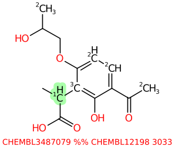

# Enumeration
This tool exhaustively adds fragments to starting molecules.

The strategy has been employed as part of hit followup for some
time, this tool is designed to make that process more efficient.

Typically the fragments to be added will have been discovered by
dicer, or manually curated. Given that molecules can have several
possible sites of substitution, the numbers of
molecules generated can escalate rapidly, and many times
there is a need to explore only a small number of changes. It
may also be more efficient to do such focussed changes via a
reaction. It depends.

The tool goes to some effort to try and lessen the formation of
atomic arrangements that would be undesirable. Generally, heteratoms
are never joined, but there are also heuristics to avoid generating
aminals and other readiliy anticipated undesirable motifs.

Multiple generations of additions are typically done by
piping the ouput from one invocation into a subsequent
invocation.

One of the motivations for this tool is having seen people run
long-running, very expensive generative A/I experiments where
one of the key questions is whether or not the method can
generate obvious solutions. Sometimes they can, sometimes not
it seems. Using Cheminformatics to definitely generate all
slight variants ensures that a thorough exploration of nearby
space is done.

## Example Usage

For example, a common workflow might be to put an isotopic label
on each atom with an available Hydrogen atom. Restrict to just
carbon atoms with no attached heteratoms. Use isotope 2 to mark the
available atoms in the starting molecule.
```
tsubstructure -s '[#6T0H>0]' -j 2 -j same -m marked -v file.smi
```
Generate some small fragments, max 7 atoms, from Chembl. Mark
these with isotope 1.
```
dicer -B nooutput -B nbamide -B brcb -k 1 -X 50 -B fragstat=small -B fragstatproto -I 1 -c -M 7
        /path/to/chembl.smi
```
Note that we put isotope 1 on the join points, since `enumeration` assumes
that the fragments will be linked via isotopes. Now we will be able to differentiate
the molecule from the fragment when viewing the product molecules. This generates 16k
fragments. Select only those with > 100 instances, this yields 1794, file `small.100`.

Adding 7 atom fragments can be a fairly large change, so lower numbers may
be called for.

Now use enumerate to combine these two. The following textproto
has the options
```
# configuration for enumeration

# Only attach to atoms in the starting molecule with isotope 1
ok_attach: "SMARTS:[2]"

write_parent: true

# If more than 10 sites in a molecule, downsample to that number
downsample_threshold: 10

check_valences: true

charge_assigner: "ENV=/home/ian/LillyMol/data/queries/charges"

isotope_at_join: 3

max_atoms_in_product: 40
```

Invoke with
```
enumeration -F PROTO:small.100 -g all -C e.text.proto -v marked.smi > product1.smi
```
Given 996 random Chembl molecules in `marked.smi` this generates 7.8M molecules in
about 10 minutes - discarding a further 3.4M that had more than 40 heavy atoms.

If a smaller fragment library were used, the file `product1.smi` could be used
as input for another invocation. In order to facilitate this, and to 
avoid the situation where an attachment point that has already had
a fragment attached, would get substituted again, we can apply
an isotope to the atom in the molecule that received the new sidechain. That
way, if the products are used as input to another run, and an isotope
is used as the atom marker, those atoms, even if they still have a Hydrogen
atom, will not be further substituted.

This is activated by the `isotope_at_join` directive in the proto shown
above.

A typical product might look like

where we see isotope 2 on the unreacted starting molecule sites, isotope
3 where the sidechain was attached, and isotope 1 as the first atom
in the fragment.


## Adjacency Considerations
The tool has some in-built rules to avoid forming unwanted functional
groups. These include things like aminals, biphenyls and several others.
These could be made optional by making settings in the proto. Note
however that the tool does not fully guard against formation of undesirable
groups. There are quite a few queries in the Lilly Medchem Rules that
can be formed, even though neither component contains those
problematic groups. 

In current form, 6300 of 734k molecules generated from about 600 random
Chembl molecules fail the Lilly Medchem Rules after enumeration, less than 1%.
Applying the Medchem Rules after generation is comparatively expensive.

It may also be a good idea to pass generated molecules through the
synthetic precedent tool. But caution is needed. For example
if the knowledge base used by the synthetic precedent tool is
Chembl, and the starting molecules are Chembl molecules, you will
definitely see unprecedented arrangements of atoms, especially
at larger radii. Building the knowledge based with different
collections can help, and also just focus attention on
radius 1 misses.

Adding atom typing to fragments can also be helpful with this, although
that functionality is not enabled in this tool.


## Summary
This tool is used for exhaustive enumeration around a molecule of
interest. Its use should be considered complementary to more
"adventurous" generative tools.
