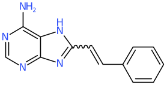
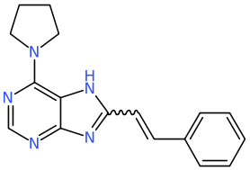
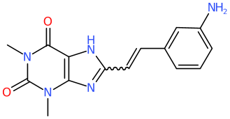
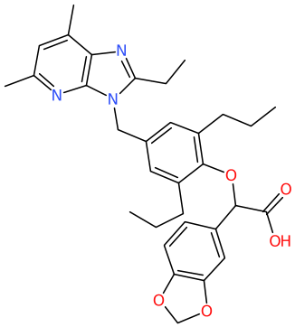
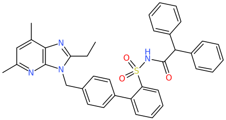

# fingerprint_substructure

`fingerprint_substructure` generates fingerprints for a subset of the atoms in
a molecule. The subset is defined by a query, and an optional radius.

This can be useful in the case of a set of reagents, and you want to know,
within a given radius, how many different reagents are there? If you try
to do that with actual molecules, you run into problems with rings and such
that get destroyed if certain subsets are formed. Fingerprinting the
subset of atoms solves that problem.

## Minimal example
Assemble a set of acids.

```
tsubstructure -s '1[OD1H]-C=O' -m acid -v haystack.smi
```
Fingerprint the acid and 3 atoms out.

```
fingerprint_substructure -v -s '[OD1H]-C=O' -x 3 -J FPSUB acid.smi > acid.gfp
```
By default, it produces a linear path fingerprint. The tool can also generate
atom-pair fingerprints with `-M`, and other standard fingerprint forms via
`-Y`.

Run leader/sphere exclusion on the resulting fingerprint file with a small
radius in order to group common acids - common to 3 atoms from the acid.
```
gfp_leader -t 0.01 acid.gfp > acid.ldr
nplotnn -L def acid.ldr > acid.ldr.smi
```
which contains things like
```
CNCC(=O)O EN300-20732 CLUSTER 6 (143 members)
OC(=O)CNC1CC1 EN300-42543 CLUSTER 6.1 1 0
CCCNCC(=O)O EN300-51247 CLUSTER 6.2 2 0
CC(C)NCC(=O)O EN300-33393 CLUSTER 6.3 3 0
NC(=O)NCC(=O)O EN300-10397 CLUSTER 6.4 4 0
OC(=O)CNC(=O)C=C EN300-222214 CLUSTER 6.5 5 0
COCCNCC(=O)O EN300-77920 CLUSTER 6.6 6 0
CC(C)(C)NCC(=O)O EN300-54858 CLUSTER 6.7 7 0
CNC(=O)NCC(=O)O EN300-36911 CLUSTER 6.8 8 0
COC1=C(C=CC(=C1)S(=O)(=O)NC1=CC=C(C=C1)C(=O)NCC(=O)O)NC(=O)C EN300-11702 CLUSTER 6.142 142 0
```
all these molecules present the same 3 atom radius context around the acid.

For faster processing, but possibly less useful output, use `tdt_sort` to perform a text sort the
fingerprint field in the resulting fingerprint file.
```shell
fingerprint_substructure ... file.smi > file.gfp
tdt_sort -s file.gfp > file.gfp.sorted.
```
This will not generate the cluster size information generated by gfp_leader, but may
be a useful approach in some circumstances.

## Usage

The following options are recognised.

```text
 -q ...        query specifications for identifying the subset.
 -s <smarts>   smarts to identify the subset.
 -x <number>   include atoms within <number> atoms of the subset.
 -d a1-a2      query is a down-the-bond type. Fingerprint all atoms down the bond
               defined by matched atoms a1->a2.
 -P ...        atom typing specification, enter '-P help' for info.
 -I <stem>     file name stem for isotopically labelled subset molecules.
 -Y ...        standard fingerprint options.
 -J <tag>      tag to use for fingerprints.
 -M            produce atom pair fingerprints.
 -C <radius>    produce EC fingerprints with maximum shell radius <radius>.
 -f            work as a TDT/fingerprint filter.
 -z ...        match handling options, enter '-z help' for info.
 -T ...        standard element transformations, for example -T I=Cl -T Br=Cl.
 -O ...        other options, enter '-O help' for info.
 -l            reduce to largest fragment.
 -i <type>     input specification.
 -g ...        chemical standardisation options.
 -E ...        standard element specifications.
 -A ...        standard aromaticity specifications.
 -v            verbose output.
```

The matched atoms that define the subset must be defined by one or more queries.
By default, all embeddings from all matching queries contribute to the subset.
It is therefore very important that the atom ordering across multiple queries be
consistent with the subset intention.

The `-x` option defines a radius around the matched atoms. Atoms within that
radius are also included in the fingerprinted subset.

### Match handling

By default, all embeddings of a matching query contribute to the subset. For
example, the SMARTS `C` matches both carbon atoms in `CCO`, so both carbon atoms
will be included when no other match-control option is specified.

The `-z` options control special cases.

- `-z i` ignores molecules that do not match any query and writes an empty
  fingerprint for them. If `-O NATAG=...` is active, the empty subset writes
  a zero atom count.
- `-z e` writes one fingerprint for each substructure embedding.
- `-z f` processes only the first embedding.

`-z e` and `-z f` are mutually incompatible and are rejected if specified
together.

If a molecule does not match any query, the default behaviour is to terminate
processing with an error. Use `-z i` only when nonmatching molecules should be
retained with empty fingerprints.

### Other options

Use `-O NATAG=<tag>` to write the number of atoms in the subset. This includes
atoms brought in by `-x`, and writes zero for ignored no-match molecules.

Use `-O INTAG=<tag>` and `-O OUTTAG=<tag>` to change the input and output
smiles tags used with TDT input. Use `-O ISO=<tag>` or `-O isosmi` for
isotopically labelled parent smiles. Isotopically labelled subset molecules can
also be written to the `-I` file.

The `-M` option generates atom-pair fingerprints within the matched and expanded
subset. The `-C` option generates EC fingerprints for the strict atom subset,
with shells starting only at included atoms and expanding only through included
atoms. The `-Y` option enables the standard fingerprint option handling for
other fingerprint forms. Only one of `-C`, `-M`, and `-Y` may be specified.

The `-P` option allows custom atom typing, which applies to all fingerprints
generated.

### Use with `gfp_make.sh`

This tool is commonly invoked by the LillyMol fingerprint generator
`gfp_make.sh`.

```shell
gfp_make.sh ... -FPS -s 'cOC' -d 0-1 -FPS ... file.smi > file.gfp
```

If the SMARTS becomes complex and quoting becomes problematic, put the SMARTS
into a file and read it as a file of SMARTS with `-q S:`.

```shell
gfp_make.sh ... -FPS -q S:file.smt -x 2 -FPS ... file.smi > file.gfp
```

`gfp_make.sh` applies the `-z i` option automatically.

### Filter mode

With `-f`, input is an existing TDT/fingerprint stream rather than a structure
file. The tool copies input records to output and, whenever it sees a smiles
record such as `$SMI<...>`, parses that smiles and inserts the subset
fingerprint into the stream.

Use the usual LillyMol stdin filename alias when reading a fingerprint stream
from standard input. For example:

```shell
fingerprint_substructure -f -z i -s C -O NATAG=NAT - < existing.gfp > annotated.gfp
```

Without `-f`, `-` means that structure input is read from standard input, for
example:

```shell
cat file.smi | fingerprint_substructure -g all -l -s '[OH]-C=O' -x 2 -
fingerprint_substructure -g all -l -s '[OH]-C=O' -x 2 - < file.smi
```

## Down the bond
Rather than a fixed radius from matched atoms, we can instead use the query to
identify a substituent. The `-d` option allows specification of two matched
atoms where the first matched atom defines an anchor, and the second matched
atom the first atom in the substituent. All atoms in the substituent are
included in the subset of atoms fingerprinted.

For example to examine substituents at an indole, one might try
```
fingerprint_substructure -s ' n1c2aaana2aa1-!@[R0]' -d 8-9 -J FPS file.smi > file.gfp
```

and we find that these two structures


are identical and

is a near neighbour.

The `-x` option also works, which can add more context to the matches. Adding
`-x 3` now finds matches like

and

to be identical. The substituent is an ethyl in both cases, and the
substituents on the ring, to 3 bonds, are identical.

Using the down the bond construct here is basically equivalent to 
detaching the substituents, possibly with a part of the scaffold
and fingerprinting fragment. This is just more convenient, and
may be useful helping to understand an SAR series.

If the matched atom numbers supplied to `-d` are outside the embedding produced
by the query, processing stops with an error. This usually means that the query
atom ordering and the `-d a1-a2` specification are inconsistent.
