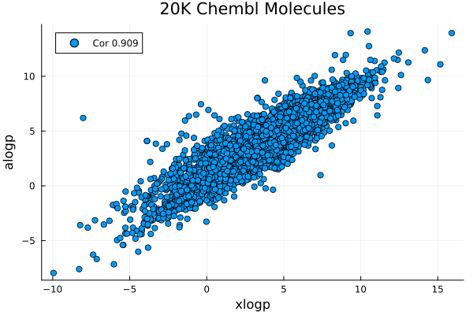

# logP

LillyMol contains two logP estimators

* xlogp version 2
* alogp

These are local implementations based on these papers.
```
Computation of alogp
Scott A Wildman, Gordon Crippen
J Chem Inf Comput Sci 1999, 39, 868-873
```
and
```
J. Chem. Inf. Comput. Sci. 1997, 37, 3, 615–621
Wang Fu Lai
```

## AlogP
This is designed to be a faster version of the implementation available within
RDKit. Generally results are very comparable. Across a random set of 20k
molecules from Chembl, the correlation is 0.999, with 18740 molecules
yielding identical results. Of the 1259 molecules with a difference, 964
have a difference of 0.001, indicating a likely numerical issue. So
only 295 of the 20k molecules had any difference at all.
```
1259 abs diffs btw 0.001 3.881 ave 0.0908602
```
Of the molecules above 0.001, the average difference is 0.385.


Almost all of the significant differences can be attributed to differences
in aromaticity perception between RDKit and LillyMol. This is of course
a much larger discussion and is not addressed here.

Timing seems favorable. The computation for 20k molecules took about
7 seconds with RDKit python, and about 0.5 seconds for the LillyMol C++
version. Computing alogp for all 2.24M molecules in a recent Chembl takes
44 seconds.

## XLogp Version 2
This is version 2 of xlogp. Plans are underway to implement version 3.



Timing is not quite as fast as alogp, with 20k molecules processed in
about 0.8 seconds.

## Summary
It is unclear just how good these atom additivity logP estimators are. See
[xlogp.h](/src/Molecule_Tools/xlogp.h) where I present comparisons with 
experimental logP data. The RDKit alogp estimator seemed to be the
worst performing of the estimators examined. The LillyMol version was
not available at the time, but given the strong concordance between
RDKit and Lillymol implementations, results should be similar.

Generally the xlogp model exhibited better concordance with experimental.

Particularly concerning was the ability of any of the estimators to
reliably predict that a molecule's experimental logP was above 5.
All estimators were very poor, with sensitivity values ranging
between 12 and 15 percent - again with alogp being the worst choice.
We do however note that Lipinski's original work was done with
the alogp implementation in Pipeline Pilot, but we do not
have any means of comparing that. 

If you have access to experimental data, building a model will very
likely yield a better model.
