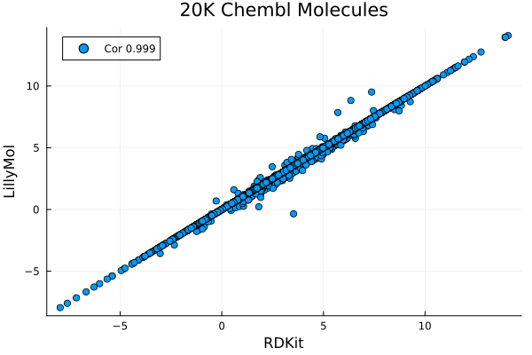

# logP

LillyMol contains two logP estimators

* xlogp version 2
* alogp

These are local implementations based on these papers.
```
Computation of alogp
Scott A Wildman, Gordon Crippen
J Chem Inf Comput Sci 1999, 39, 868-873
```
and
```
J. Chem. Inf. Comput. Sci. 1997, 37, 3, 615–621
Wang Fu Lai
```

## AlogP
This is designed to be a faster version of the implementation available within
RDKit. Generally results are very comparable. Across a random set of 20k
molecules from Chembl, the correlation is 0.999, with 18740 molecules
yielding identical results. Of the 1259 molecules with a difference, 964
have a difference of 0.001, indicating a likely numerical issue. So
only 295 of the 20k molecules had any difference at all.
```
1259 abs diffs btw 0.001 3.881 ave 0.0908602
```
Of the molecules above 0.001, the average difference is 0.385.



Almost all of the significant differences can be attributed to differences
in aromaticity perception between RDKit and LillyMol. This is of course
a much larger discussion and is not addressed here.

Timing seems favorable. The computation for 20k molecules took about
8.6 seconds with RDKit python, and about 0.5 seconds for the LillyMol C++
version. Computing alogp for all 2.24M molecules in a recent Chembl takes
44 seconds.

The LillyMol implementation is also available via python bindings, and
the 20k molecules are computed in 1.1 seconds. All of Chembl is processed
in 1 minute 52 seconds, more than 2x slower than pure C++.

## XLogp Version 2
This is version 2 of xlogp. Plans are underway to implement version 3.


Timing is not quite as fast as alogp, with 20k molecules processed in
about 0.8 seconds.

In retrospect, the xlogp version could be further optimised for speed.

## Accuracy
It is unclear just how good these atom additivity logP estimators are. See
[xlogp.h](/src/Molecule_Tools/xlogp.h) where I present comparisons with 
one particular set of experimental logP data. The RDKit alogp estimator seemed to be the
worst performing of the estimators examined. The LillyMol version was
not available at the time, but given the strong concordance between
RDKit and Lillymol implementations, results should be very similar.

xlogp (version 2) was slightly better than RDKit alogp, and
Marvin seemed to do slightly better than both on that set of
experimental data.

For public data, we can use the data provided by 
```
T.J. Hoy and X. J. Xu
ADME Evaluation in Drug Discovery. 2. Prediction of Partition Coefficient by Atom-Additive Approach Based on Atom-Weighted Solvent Accessible Surface Areas
J. Chem. Inf. Comput. Sci. 2003, 43, 3, 1058–1067
```
where the supplementary material has data on almost 2000 logP measurements.


Here, the xlogp model exhibits significantly better concordance with
experimental compared with alogp. This of course raises an interesting
issue. It seems that observed performance can be a function of the
test set used. This is of course quite reasonable to expect, many
of the training sets used for these models are not public, and
to the extent new training sets overlap with the molecules used
to calibrate these models, good results should be expected.

Another excellent data source is from (weil)[https://weilab.math.msu.edu/DataLibrary/2D/]
which contains several logP datasets, including one with 8k molecules. Here alogp and
xlogp appear to be largely identical in performance


Despite earlier finding that a composite model did not improve performance with
one set of experimental data, here we find that a composite model of the two
does lead to an improved model


This if course raises the question, for what purpose do we compute logp?
Do we compute it because we need a reliable estimate of Octanol/Water
partitioning? Are we computing it in order to use the same calculations
pioneered by Lipinski?

Given the common use of 5.0 as a cutoff, we can ask how well these predictors
do as a clasifier - how well do they predict molecules above 5.0? Again, if
all we are trying to do is replicate Lipinski's work, it does not matter how
well, or not, these models can predict a high measures Octanol/Water partition
coefficient.

Within the 8200 molecues in the Weil set, there are 291 with measured
values above 5.0 (3.5%).  Alogp predicts 246 (210 true positive),
xlogp predicts 302 (232 true positive).  Alogp has a PPV of 0.76,
whereas alogp has a PPV of 0.85, but alogp's false negative rate is
higher 81 missed vs 59. Model choice might depend on what you are
trying to optimise.

And again, if what you are trying to do is match what Lipinski did,
regardless of how that might correspond with an experimental logP,
then alogp is the only choice. I have seen papers discussing the rule
of five that began with a summary of lotP estimators. That is fine,
but those models will need to be recalibrated with a possibly
different logP estimate.

If you have access to experimental data, building a model will very
likely yield a better model.
