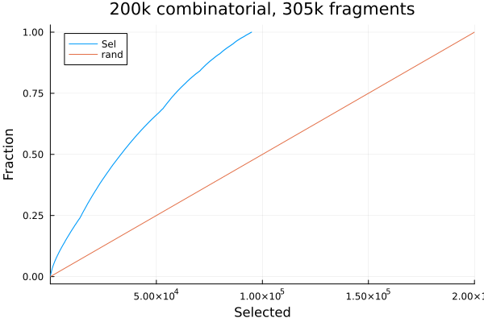

# parsimonious_set
This tool is designed to help with the problem of having a large number of molecules
for which an expensive calculation is desired, but the number of candidates is too large
for the expensive calculation.

This tool works on fragmented molecules (from dicer), and then attempts to form a subset
that exemplifies as many of the fragments in the input set as possible.

The first implementation of the tool is for supporting DEL results, where the molecules
are combinatorially derived, so there is a strong expectation of common fragments, but 
where there might be 10's or even hundreds of thousands of 'active' molecules, for
which it might be infeasible to run an expensive (3D) computation.

The tool is very simple (greedy), using `dicer` as the means of
fragmenting the molecules.  By design this avoids infeasible things
like Maximum Common Substructure computations.  Generally LillyMol
uses `dicer` fragments for realistic approximations to MCS in many
ways, and this is just another example.

Once the molecules are fragmented, this tool reads the fragmentation data and collates
all fragments appearing anywhere in the set.

It sorts those fragments by size, largest to smallest. Then, for each fragment, it
looks for the first molecule that exemplifies that fragment. That molecule is
marked as selected, and for all the fragments it contains, it also marks those
fragments as selected.

This way, we expect the smaller fragments to be filled in by the largest
candidates as they are selected for their larger fragments.

The list of fragments is scanned until either

* all fragments have been represented
* the number of molecules requested has been selected.

## Fragmentation
The success of this tool will very much depend on the fragmentation done by
`dicer`. Fragments should not be too small, nor too large. 

For testing, I found the following `dicer` invocation useful
```
dicer -I 1 -X 64 -m 3 -M 20 -M maxnr=10 -v -B nbamide -B brcb -B serialized_proto -S dicer.data -k 3 -c file.smi
```
where we create fragments with as many as 3 connections, that have a minimum of
three atoms, and a max of 20, with at most 10 non ring atoms. Hopefully this will
get many of the scaffolds, or scaffold subsets, in the set. Running this on 100k
random molecules from Chembl takes 2:33 minutes. Running on 200k random molecules
from a larger combinatorial library takes 1:30.

Allowing such large fragments, 20 atoms, should allow for reasonable subsets of
scaffolds to be included as scaffolds. If this number is too small, then only
single ring system fragments will be included. Perhaps that should be an option
to dicer, or perhaps adapt `molecular_scaffold`. But limiting the number of
non-ring atoms to 10 should also suppress excessively flexible long fragments.

Again, there is no 'right' answer for how the molecules should be fragmented.

## Selection
Once the fragmentation scheme from `dicer` is available, parsimonious_set can be used
to select a subset.

You must specify the number of items to be selected via the `-nsel` option, it must
be less than the number of items in the set.

The first thing the tool does is to sort the candidate molecules by atom count
smallest first. The tool works by scanning the fragments, and for each fragment
selecting the first molecule that exemplifies that fragment. By sorting, the
smallest exemplar is chosen, which seems desirable.

You may however have the case of a set of molecules where there is a known
desirability function, and instead you want to preferentially sample from the
most desirable molecules. In that case use the `-nosort` option, to suppress
the initial candidate atom count sort.

The `-support` option discards any fragment from the input that occurs in
less than that number of molecules. It is unclear whether this is desirable
or not.

The `-randf` option randomises the fragments before selection. This way
the tool will be non-deterministic. Different invocations may generate 
beffer performing outcomes.

The `-sortf` option sorts the fragments by frequency - within atom count
bands. This way, the most frequently occurring fragments should have
a higher probability of being selected. This seems to only make a minor
difference, but generally seems desirable.

## Example
From a 1M acid + amine virtual library, select 200k random molecules.
Run through dicer as described above. Select a 50k subset of the 200k
```
parsimonious_set -nsel 50000 -sortf -v rand200k.dicer.data 
```
The output consists of three tokens.

1. smiles of the selected molecule
2. id of the selected molecule
3. fraction of features covered

In this case, even though only 25% of the molecules are selected,
50k of 200k, this 50k subset exemplifies 66% of the features in the
set. The log file shows
```
103534 of 305620 fragments not represented in 50000 selections 0.338767
 atoms btw 5 and 20 ave 16.9872
 instances btw 1 and 293 ave 1.47184
```
So on average, the 103k omitted fragments occurred in 1.47 molecules.

If we allow the selection to select all molecules, we can then
plot the fraction of fragments discovered as a function of the number
of molecules selected.

Where visually see see 66% of the fragments selected with 50k
molecules selected.

If instead a random sample of 50k molecules was selected, the
fraction of fragments covered is observed to be 38% - significantly
higher than the straight line in the graph, but much lower than
our selected line. We conclude that indeed the method generating
a more comprehensive list of molecules, that is doing an efficient
job of exemplifying the fragments in the input set.

# Limitations
This of course does not account for the fact that fragments can be
subsets of each other and strongly correlated. But discerning these
subset relationships across hundreds of thousands of fragments would
be challenging - probably quite doable, but it would take time. Given
the identities of the molecules containing each fragment would likely
provide a major optimisation, since subset relationships among fragments
would also need to be exemplified in the molecules matched.

The current implementation is greedy. It is quite possible that an optimisation
layer could yield much better results - perhaps along the lines of form a
particular subset, then look at fragments not represented, and see if
swapping some candidates from unselected to selected might improve
things. Again the fragment subset relationship looms large over this.

# Summary
Even in its initial simple and greedy implementation, it has
shown its ability to produce subsets that provide enhanced representation
of the fragments present.


